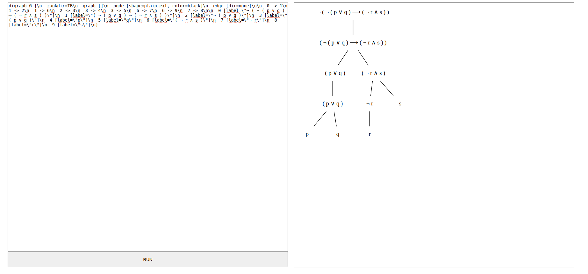

## **TEMA 1**
Sintaxis y Semántica en LP y LPO
====================

Descripción general del capítulo
--------------------------------

En este capítulo se recogen, de forma detallada, los módulos implementados que abordan el ámbito de la sintaxis y semántica de la Lógica Proposicional y Primer Orden. Complementariamente, en el *Anexo A. Parsers* se encuentra el desarrollo de varios Parsers, que nos permiten acercar la escritura natural de las fórmulas a la definición en el sistema.

### <u> Estructura del capítulo </u>

El capítulo se encuentra estructurado en distintas secciones, a través de las cuales se abordan los conceptos fundamentales del ámbito sintáctico-semántico de la LP y la LPO, presentados conjuntamente con los módulos que implementan dichos conceptos:

-   **Módulo SintaxSemanticsLP**. Recoge las implementaciones de los tipos fundamentales relacionados con los aspectos sintácticoS Y semánticos de la Lógica Proposicional.

-   **Módulo SintaxSemanticsLPO**. Recoge las implementaciones de los tipos fundamentales relacionados con los aspectos sintácticos y semánticos de la Lógica de Primer Orden.

-   **Módulo IO\_LP**. Recoge las implementaciones de los métodos relacionados con la lectura y representación de las fórmulas LP.

-   **Módulo IO\_LPO**. Recoge las implementaciones de los métodos relacionados con la lectura y representación de las fórmulas LPO.

1.1. Conceptos básicos de la Lógica Proposicional
--------------------------------------------

### Caracterización básica de la Lógica Proposicional

La Lógica surge como método de modelado del siguiente problema:

> *Dado un conjunto de asertos (afirmaciones), $\mathcal{BC}$ (*Base de conocimiento*), y una afirmación, $\mathcal{A}$, decidir si $\mathcal{A}$ ha de ser necesariamente cierta supuestas ciertas las fórmulas de $\mathcal{BC}$.* 

De manera que para abordar este problema resultan necesarios los siguientes elementos:

-   Un lenguaje que permita expresar de manera formal y precisa las afirmaciones, hechos e hipótesis. (<u>Sintaxis</u>)

-   Una definición clara de qué se considera *afirmación cierta*  (<u>Semántica</u>)

-   Mecanismos efectivos (y a poder ser eficientes) que garanticen la corrección (y preferentemente la completitud) en las deducciones. (<u>Algoritmos de decisión</u>)

A lo largo de los distintos capítulos abordaremos estos puntos para las dos representaciones más comunes, la Lógica Proposicional (*LP* o *PL*) y la Lógica de Primer Orden (*LPO* o *FOL*).

Por el momento vamos a comenzar este primer capítulo abordando los dos primeros puntos para la Lógica Proposicional y la Lógica de Primer Orden, dando una somera introducción al tercero para cada caso dejando el desarrollo de los algoritmos de decisión, que se irán abordando a lo largo del resto de capítulos.

#### Características fundamentales de la LP.

-   Sus expresiones (denominadas f*órmulas proposicionales* o *proposiciones*) modelan afirmaciones que pueden considerarse *ciertas* o *falsas*.

-   Las fórmulas proposicionales (en adelante fórmulas (si no existe ambigüedad)), se construyen mediante un conjunto de expresiones  básicas (*fórmulas atómicas* o *átomos*) y conjunto de operadores (*conectivas lógicas*). Dichas conectivas permiten modelar los  siguientes tipos de afirmaciones:

    -   *Conjunción*: ‘... tal ... Y ... cual ...’

    -   *Disyunción*: ‘... tal ... O ... cual ...’

    -   *Implicación*: ‘SI tal ... ENTONCES ... cual ...’

    -   *Equivalencia*: ‘... tal ... SI Y SÓLO SI ... cual ...’

    -   *Negación*: ‘NO es cierto tal ...’

    Profundizaremos en este aspecto en la próxima sección, cuando  veamos la *Sintaxis de la LP*.

-   El lenguaje sólo permite modelar este tipo de afirmaciones, por lo que muchas veces puede ser difícil (o imposible) representar el problema en este tipo de Lógica, y es necesario recurrir a otras más  ricas (*LPO, Lógicas Modales, Lógica Fuzzy, etc*). Especificaremos este apartado cuando tratemos las limitaciones de la LP e introduzcamos la LPO.

-   Aunque esta Lógica puede resultar de una aparente sencillez, el problema *SAT* corresponde a la categoría de problemas NP-completos, esto es, no existe ningún algoritmo capaz de resolver el problema planteado en un tiempo polinomial de ejecución. Trataremos de nuevo este aspecto en la introducción a los algoritmos de decisión.

1.2. Fundamentos de la lógica proposicional
--------------------------------------------

Vamos a abordar desde un punto de vista teórico-práctico, los elementos base que conforman la Lógica Proposicional, esto es la Síntaxis y la Semántica, mostrando unificadamente los desarrollos formales como las implementaciones llevadas a cabo para modelar cada uno de ellos.

### Sintáxis de la lógica Proposicional

#### El alfabeto proposicional

El concepto ‘*alfabeto proposicional*’ referencia al conjunto de símbolos que forman parte de este lenguaje. Podemos distinguir las siguientes categorías:

-   **Variables proposicionales o átomos**. Ya hemos señalado previamente que todo problema está representado por relaciones entre un conjunto finito de afirmaciones básicas, dichas afirmaciones se representan por símbolos proposicionales: $VP = \{p_0, p_1, \ldots, p, q, r\}$.   

    Aunque, formalmente, no existe ninguna restricción, vamos a adoptar el siguiente criterio en relación a la sintaxis de los símbolos proposicionales:  

    > Los símbolos proposicionales deben comenzar por una letra minúscula, seguida (opcionalmente) de otros caractéres en minúscula o dígitos numéricos, exclusivamente.

-   **Conectivas Lógicas**. Modelan las relaciones entre las distintas afirmaciones básicas (átomos). Podemos distinguir:

    -   De aridad 1 o monoaria : *Negación* ($\neg$).

    -   De aridad 2 o binarias: *Conjunción* ($\wedge$), *Disyunción* ($\vee$), *Condicional* ($\rightarrow$), *Bicondicional* ($\leftrightarrow$).  

-   **Símbolos Auxiliares**: ‘*(*’ y ‘*)*’. Permiten expresar relaciones de prioridad entre conectivas lógicas y evitar la ambigiüedad en la interpretación de las fórmulas.

#### Fórmula Proposicional

Se denomina expresión del lenguaje proposicional a cada una sucesión finita (y no vacía) de sus símbolos y conectivas.Un ejemplo de expresión puede ser la siguiente $a \rightarrow b )ca\vee$, otro puede corresponder a $(a \rightarrow b ) \vee c$. Parece claro que el primero posee “una coherencia” o“equilibrio que no parece tener el primero. De esta forma, las expresiones "bien formadas" las denominaremos **fórmulas proposicionales**.

> Formalmente, El conjunto de las fórmulas proposicionales, $PROP$, es el menor conjunto de expresiones que verifica:
> - $VP \subseteq PROP$
> - Es cerrado bajo las conectivas lógicas, esto es:
    - Si una fórmula $F \in PROP$, entonces $\neg F \in PROP$
    - Si las fórmulas $F, G \in PROP$, entonces $(F \wedge G), (F \vee G), (F \rightarrow G), (F \leftrightarrow G) \in PROP$

De manera que se tiene una definición recursiva del concepto de *Fórmula Proposiciona*, tal que el caso base corresponde a una fórmula básica (*átomo*) y el caso recursivo corresponde a la aplicación de una conectiva sobre una o dos fórmulas (según la aridad de la conectiva).

##### Árboles de formación

Cada una de las fórmulas proposicionales lleva asociado un grafo de tipo árbol (esencialmente único), que muestra el desarrollo de formación de la fórmula, siguiendo la definición recursiva de la misma.

Por ejemplo a la fórmula: $\neg(\neg(p \vee q) \rightarrow (\neg r \wedge s))$ le corresponde el árbol de formación:

 
 

##### Prioridad de conectivas y Reducción de paréntesis.

Para facilitar la escritura y lectura de las fórmulas vamos a adoptar algunos criterios:

1.  Omitimos los paréntesis externos.  
2.  Tomaremos como orden de precedencia de las conectivas (de mayor a  menor): $\neg$, $\wedge$, $\vee$ , $\rightarrow$, $\leftrightarrow$. (Para la conectiva $\leftrightarrow$ se recomienda mantener los paréntesis en todos los casos).  
3.  Cuando una conectiva se usa repetidamente, se asocia por la derecha.  

##### Principio de inducción sobre fórmulas

Gracias a la definición de $PROP$ (y su estructura recursiva), para probar que toda fórmula proposicional satisface una cierta propiedad ($\Psi$), podemos hacerlo aplicando el método de inducción sobre fórmulas.

De esta forma, probamos:

1.  (*Caso base*). Probar que todos los elementos de $VP$ tienen la propiedad $\Psi$.

2.  (*Paso de inducción*).

    -  Si $F \in PROP$ tiene la propiedad $\Psi$, entonces $\neg F$ tiene la propiedad $\Psi$.

    -  Si $F, G \in PROP$, tienen la propiedad $\Psi$ entonces $(F \wedge G), (F \vee G), (F \rightarrow G), (F \leftrightarrow G) \in PROP$ tienen la propiedad $\Psi$

##### Escritura de las fórmulas en Logicus

Vamos a exponer cuál es la sintaxis de las fórmulas utilizando la librería Logicous, que nos permitirá definir fórmulas y aplicar diversos algoritmos sobre las mismas. 

En la librería podemos definir las fórmulas de dos formas distintas, o bien acudiendo directamente a los constructores de las fórmulas (largo y engorroso), o bien utilizando el Parser (de forma análoga a la escritura natural de las fórmulas).

$\longrightarrow$ <u>Definición de fórmulas a partir de constructores</u>

Si recordamos la definición recursiva que se ha dado para las fórmulas, expusimos que las mismas pueden corresponder o bien a átomos (*caso base*), o bien a la aplicación de las conectivas, teniendo en cuenta la aridad de éstas, sobre fórmulas proposicionales (*caso recursivo*). 

Bien, pues la implementación dada en la librería para las fórmulas corresponde fielmente a dicha definición. De forma que:

- Los símbolos proposicionales se definen como cadenas de caractéres, (recordando el criterio, estos caracteres deben ir en minúscula).  

        type alias PSymb = String 

- Las fórmulas proposicionales se definen según la estructura recursiva presentada.  

        type FormulaLP = Atom PSymb                 -- caso base 
                        | Neg FormulaLP             --⎫
                        | Conj FormulaLP FormulaLP  --⎪
                        | Disj FormulaLP FormulaLP  --⎬ casos recursivos
                        | Impl FormulaLP FormulaLP  --⎪
                        | Equi FormulaLP FormulaLP  --⎭
                        | Insat                     -- fórmula insatisfactible

Esto nos permite definir todas las fórmulas proposicionales, para muestra algunos ejemplos:

a. $(p \wedge q) \vee (p \wedge r) \quad$ b. $ (p \wedge r) \vee (\neg p \wedge q) \rightarrow \neg q \quad$ c. $(p \leftrightarrow q) \wedge (p \rightarrow \neg q) \wedge p$ 

<pre style="background-color: #2B3856; color: white;">---- Elm 0.19.1 ----------------------------------------------------------------
Say :help for help and :exit to exit! More at &lt;https://elm-lang.org/0.19.1/repl&gt;
--------------------------------------------------------------------------------
&gt; import Modules.SintaxSemanticsLP exposing (..)
&gt; import Modules.IO_LP exposing (toStringFLP)
&gt; a = Disj (Conj (Atom &quot;p&quot;) (Atom &quot;q&quot;)) (Conj (Atom &quot;p&quot;) (Atom &quot;r&quot;))
Disj (Conj (Atom &quot;p&quot;) (Atom &quot;q&quot;)) (Conj (Atom &quot;p&quot;) (Atom &quot;r&quot;))
    : FormulaLP
&gt; toStringFLP a
&quot;( ( p ∧ q ) ∨ ( p ∧ r ) )&quot; : String
&gt; b = Impl (Disj (Conj (Atom &quot;p&quot;) (Atom &quot;r&quot;)) (Conj (Neg (Atom &quot;p&quot;)) (Atom &quot;q&quot;))) (Neg (Atom &quot;q&quot;))
Impl (Disj (Conj (Atom &quot;p&quot;) (Atom &quot;r&quot;)) (Conj (Neg (Atom &quot;p&quot;)) (Atom &quot;q&quot;))) (Neg (Atom &quot;q&quot;))
    : FormulaLP
&gt; toStringFLP b
&quot;( ( ( p ∧ r ) ∨ ( ¬ p ∧ q ) ) ⟶ ¬ q )&quot; : String
&gt; c = Conj (Conj (Equi (Atom &quot;p&quot;) (Atom &quot;q&quot;)) (Impl (Atom &quot;p&quot;) (Neg (Atom &quot;q&quot;)))) (Atom &quot;p&quot;)
Conj (Conj (Equi (Atom &quot;p&quot;) (Atom &quot;q&quot;)) (Impl (Atom &quot;p&quot;) (Neg (Atom &quot;q&quot;)))) (Atom &quot;p&quot;)
    : FormulaLP
&gt; toStringFLP c
&quot;( ( ( p ⟷ q ) ∧ ( p ⟶ ¬ q ) ) ∧ p )&quot; : String
</pre> 

*NOTA: La función 'toStringFLP' permite dar una representación en formato cadena a las fórmulas*

Como se puede apreciar, escribir las fórmulas de esta forma puede resultar una tarea ardua y propensa a errores, por eso, se ha desarrollado un parser que nos permite escribir de forma más cómoda,sintética y visual las fórmulas. Para poder utilizarlo se han establecido una serie de requisitos sintácticos, análogos a los presentados anteriormente:

- Los símbolos proposicionales deben comenzar por un caracter en minúscula seguido, opcionalmente, de caracteres en minúscula, dígitos o el símbolo '_'.  

- Para las conectivas se usarán los siguientes símbolos, mantiéndose la prioridad de las conectivas definida (en el orden de prioridad descendente expuesto en la tabla).

<table style="margin-left: auto; margin-right: auto; width:40%; border-collapse:collapse;border-color:#ccc;border-spacing:0" class="tg"><thead><tr><th style="background-color:#f0f0f0;border-color:#ccc;border-style:solid;border-width:1px;color:#333;font-family:Arial, sans-serif;font-size:14px;font-weight:bold;overflow:hidden;padding:10px 5px;text-align:center;text-decoration:underline;vertical-align:top;word-break:normal">Conectiva Lógica</th><th style="background-color:#f0f0f0;border-color:#ccc;border-style:solid;border-width:1px;color:#333;font-family:Arial, sans-serif;font-size:14px;font-weight:bold;overflow:hidden;padding:10px 5px;text-align:center;text-decoration:underline;vertical-align:top;word-break:normal">Símbolo Logicous</th></tr></thead><tbody><tr><td style="background-color:#fff;border-color:#ccc;border-style:solid;border-width:1px;color:#333;font-family:Arial, sans-serif;font-size:14px;overflow:hidden;padding:10px 5px;text-align:center;vertical-align:top;word-break:normal">Negación (¬)</td><td style="background-color:#fff;border-color:#ccc;border-style:solid;border-width:1px;color:#333;font-family:Arial, sans-serif;font-size:14px;overflow:hidden;padding:10px 5px;text-align:center;vertical-align:top;word-break:normal">'NOT'</td></tr><tr><td style="background-color:#fff;border-color:#ccc;border-style:solid;border-width:1px;color:#333;font-family:Arial, sans-serif;font-size:14px;overflow:hidden;padding:10px 5px;text-align:center;vertical-align:top;word-break:normal">Conjunción (∧)</td><td style="background-color:#fff;border-color:#ccc;border-style:solid;border-width:1px;color:#333;font-family:Arial, sans-serif;font-size:14px;overflow:hidden;padding:10px 5px;text-align:center;vertical-align:top;word-break:normal">'AND'</td></tr><tr><td style="background-color:#fff;border-color:#ccc;border-style:solid;border-width:1px;color:#333;font-family:Arial, sans-serif;font-size:14px;overflow:hidden;padding:10px 5px;text-align:center;vertical-align:top;word-break:normal">Disyunción (∨)</td><td style="background-color:#fff;border-color:#ccc;border-style:solid;border-width:1px;color:#333;font-family:Arial, sans-serif;font-size:14px;overflow:hidden;padding:10px 5px;text-align:center;vertical-align:top;word-break:normal">'OR'</td></tr><tr><td style="background-color:#fff;border-color:#ccc;border-style:solid;border-width:1px;color:#333;font-family:Arial, sans-serif;font-size:14px;overflow:hidden;padding:10px 5px;text-align:center;vertical-align:top;word-break:normal">Implicación (🡒)</td><td style="background-color:#fff;border-color:#ccc;border-style:solid;border-width:1px;color:#333;font-family:Arial, sans-serif;font-size:14px;overflow:hidden;padding:10px 5px;text-align:center;vertical-align:top;word-break:normal">'IMPLIES'</td></tr><tr><td style="background-color:#fff;border-color:#ccc;border-style:solid;border-width:1px;color:#333;font-family:Arial, sans-serif;font-size:14px;overflow:hidden;padding:10px 5px;text-align:center;vertical-align:top;word-break:normal">Equivalencia (🡘)</td><td style="background-color:#fff;border-color:#ccc;border-style:solid;border-width:1px;color:#333;font-family:Arial, sans-serif;font-size:14px;overflow:hidden;padding:10px 5px;text-align:center;vertical-align:top;word-break:normal">'EQUIV'</td></tr></tbody></table>  

- Los paréntesis se utilizan de igual forma en que se han definido en el lenguaje formal de la lógica proposicional, con los símbolos '(' y ')'. No son necesarios los paréntesis externos de las fórmulas.  

- En caso de uso repetido de una misma conectiva, se realizará asociación por la derecha.

A partir de este momento todas las fórmulas de los ejemplos se definirán utilizando el Parser por lo que llegados a este punto se recomienda tener claras las reglas sintácticas a seguir, aunque, son análogas a las planteadas por el lenguaje formal de la lógica proposicional.

Para definir los ejemplos expuestos anteriormente:

<pre style="background-color: #2B3856; color: white;">---- Elm 0.19.1 ----------------------------------------------------------------
Say :help for help and :exit to exit! More at &lt;https://elm-lang.org/0.19.1/repl&gt;
--------------------------------------------------------------------------------
&gt; import Modules.IO_LP exposing (fromStringToFLP, extractReadFLP, toStringFLP)
&gt; aAux = fromStringToFLP &quot;(p AND q) OR (p AND r)&quot;
(Just (Disj (Conj (Atom &quot;p&quot;) (Atom &quot;q&quot;)) (Conj (Atom &quot;p&quot;) (Atom &quot;r&quot;))),&quot;&quot;)
    : ( Maybe Modules.SintaxSemanticsLP.FormulaLP, String )
&gt; a = extractReadFLP aAux
Disj (Conj (Atom &quot;p&quot;) (Atom &quot;q&quot;)) (Conj (Atom &quot;p&quot;) (Atom &quot;r&quot;))
    : Modules.SintaxSemanticsLP.FormulaLP
&gt; bAux = fromStringToFLP &quot;(p AND r) OR (NOT p AND q) IMPLIES NOT q&quot;
(Just (Impl (Disj (Conj (Atom &quot;p&quot;) (Atom &quot;r&quot;)) (Conj (Neg (Atom &quot;p&quot;)) (Atom &quot;q&quot;))) (Neg (Atom &quot;q&quot;))),&quot;&quot;)
    : ( Maybe Modules.SintaxSemanticsLP.FormulaLP, String )
&gt; b = extractReadFLP bAux
Impl (Disj (Conj (Atom &quot;p&quot;) (Atom &quot;r&quot;)) (Conj (Neg (Atom &quot;p&quot;)) (Atom &quot;q&quot;))) (Neg (Atom &quot;q&quot;))
    : Modules.SintaxSemanticsLP.FormulaLP
&gt; cAux = fromStringToFLP &quot;(p EQUIV q) AND (p IMPLIES NOT q) AND p&quot;
(Just (Conj (Equi (Atom &quot;p&quot;) (Atom &quot;q&quot;)) (Conj (Impl (Atom &quot;p&quot;) (Neg (Atom &quot;q&quot;))) (Atom &quot;p&quot;))),&quot;&quot;)
    : ( Maybe Modules.SintaxSemanticsLP.FormulaLP, String )
&gt; c = extractReadFLP cAux
Conj (Equi (Atom &quot;p&quot;) (Atom &quot;q&quot;)) (Conj (Impl (Atom &quot;p&quot;) (Neg (Atom &quot;q&quot;))) (Atom &quot;p&quot;))
    : Modules.SintaxSemanticsLP.FormulaLP
&gt; toStringFLP a
&quot;( ( p ∧ q ) ∨ ( p ∧ r ) )&quot; : String
&gt; toStringFLP b
&quot;( ( ( p ∧ r ) ∨ ( ¬ p ∧ q ) ) ⟶ ¬ q )&quot; : String
&gt; toStringFLP c
&quot;( ( p ⟷ q ) ∧ ( ( p ⟶ ¬ q ) ∧ p ) )&quot; : String
</pre>

Nótese que la función *fromStringToFLP* proporciona una tupla de dos elementos el primero de ellos corresponde a la fórmula leída y el segundo a una cadena de texto. Bien, si cometemos algún error sintáctico en la escritura de la fórmula el Parser no será capaz de interpretarla correctamente por lo que devolverá una tupla *(Nothing,error)*, en el que el segundo elemento corresponderá al mensaje de error y el primer elemento a un objeto vacío.

Una vez leída la fórmula correctamente podemos extraerla utilizando la función *extractReadFLP*. Si utilizamos dicha función sobre una fórmula leída incorrectamente, se extraerá como fórmula la fórmula insatisfactible. 

<pre style="background-color: #2B3856; color: white;">---- Elm 0.19.1 ----------------------------------------------------------------
Say :help for help and :exit to exit! More at &lt;https://elm-lang.org/0.19.1/repl&gt;
--------------------------------------------------------------------------------
&gt; import Modules.IO_LP exposing (fromStringToFLP, extractReadFLP, toStringFLP)
&gt; cAux = fromStringToFLP &quot;(p EQUIV q) and (p IMPLIES NOT q) AND p&quot;
(Nothing,&quot;[{ col = 11, problem = ExpectingSymbol \&quot;)\&quot;, row = 1 }]&quot;)
    : ( Maybe Modules.SintaxSemanticsLP.FormulaLP, String )
&gt; c = extractReadFLP cAux
Insat : Modules.SintaxSemanticsLP.FormulaLP
&gt; toStringFLP c
&quot;⊥&quot; : String
</pre>

$\longrightarrow$ <u>Árboles de formación en Logicous</u>

La librería también permite la representación de los árboles de formación. La función *formtree* muestra la representación del árbol de formación en formato texto DOT. 

Por ejemplo para la fórmula $\neg(\neg(p \vee q) \rightarrow (\neg r \wedge s))$:

<pre style="background-color: #2B3856; color: white;">---- Elm 0.19.1 ----------------------------------------------------------------
Say :help for help and :exit to exit! More at &lt;https://elm-lang.org/0.19.1/repl&gt;
--------------------------------------------------------------------------------
&gt; import Modules.IO_LP exposing (fromStringToFLP, extractReadFLP, toStringFLP, formTree)
&gt; ejemplo = fromStringToFLP &quot;NOT (NOT (p OR q) IMPLIES (NOT r AND s))&quot;
(Just (Neg (Impl (Neg (Disj (Atom &quot;p&quot;) (Atom &quot;q&quot;))) (Conj (Neg (Atom &quot;r&quot;)) (Atom &quot;s&quot;)))),&quot;&quot;)
    : ( Maybe Modules.SintaxSemanticsLP.FormulaLP, String )
&gt; ejemploF = extractReadFLP ejemplo
Neg (Impl (Neg (Disj (Atom &quot;p&quot;) (Atom &quot;q&quot;))) (Conj (Neg (Atom &quot;r&quot;)) (Atom &quot;s&quot;)))
    : Modules.SintaxSemanticsLP.FormulaLP
&gt; toStringFLP ejemploF
&quot;¬ ( ¬ ( p ∨ q ) ⟶ ( ¬ r ∧ s ) )&quot; : String
&gt; formTree ejemploF
&quot;digraph G {\n  rankdir=TB\n  graph []\n  node [shape=plaintext, color=black]\n  edge [dir=none]\n\n  0 -&gt; 1\n  1 -&gt; 2\n  1 -&gt; 6\n  2 -&gt; 3\n  3 -&gt; 4\n  3 -&gt; 5\n  6 -&gt; 7\n  6 -&gt; 9\n  7 -&gt; 8\n\n  0 [label=\&quot;¬ ( ¬ ( p ∨ q ) ⟶ ( ¬ r ∧ s ) )\&quot;]\n  1 [label=\&quot;( ¬ ( p ∨ q ) ⟶ ( ¬ r ∧ s ) )\&quot;]\n  2 [label=\&quot;¬ ( p ∨ q )\&quot;]\n  3 [label=\&quot;( p ∨ q )\&quot;]\n  4 [label=\&quot;p\&quot;]\n  5 [label=\&quot;q\&quot;]\n  6 [label=\&quot;( ¬ r ∧ s )\&quot;]\n  7 [label=\&quot;¬ r\&quot;]\n  8 [label=\&quot;r\&quot;]\n  9 [label=\&quot;s\&quot;]\n}&quot;
    : String
&gt; 
</pre>

Para poder visualizar el texto en formato DOT se puede utilizar un renderizador graphviz.

Nótese que en la consola se muestran los caracteres \\n y \\", estos habría que sustituirlos antes de dárselos al renderizador. En el proyecto se da un renderizador ([Graphviz Visualizer](../../web-sources/pages/GraphVizVisualizer.html)) que permite pegar el código tal cual y así poder visualizar el árbol fácil y cómodamente. (NOTA: no se han de incluir las comillas iniciales y finales, delimitadoras de la cadena).

 
 

#### Conjuntos de fórmulas

Definido $PROP$, los conjuntos de fórmulas no son más que subconjuntos de $PROP$, esto es, corresponden a agrupaciones de fórmulas proposicionales.

##### Conjuntos de fórmulas en Logicus

Los conjuntos proposicionales se definen como listas de fórmulas proposicionales. De esta forma:

    
    type alias LPSet = List FormulaLP

De forma que la definición de estos se realiza como listas de objetos *FormulaLP*. Si por ejemplo queremos definir el conjunto: 
$$ M = \left\lbrace (p \wedge q) \vee (p \wedge r), (p \wedge r) \vee (\neg p \wedge q) \rightarrow \neg q, (p \leftrightarrow q) \wedge (p \rightarrow \neg q) \wedge p \right\rbrace$$

Podríamos hacerlo:

<pre style="background-color: #2B3856; color: white;">---- Elm 0.19.1 ----------------------------------------------------------------
Say :help for help and :exit to exit! More at &lt;https://elm-lang.org/0.19.1/repl&gt;
--------------------------------------------------------------------------------
&gt; import Modules.IO_LP exposing (fromStringToFLP, extractReadFLP, toStringFLP, toStringFLPSet)
&gt; import Modules.SintaxSemanticsLP exposing (..)
&gt; a = fromStringToFLP &quot;(p AND q) OR (p AND r)&quot; |&gt; extractReadFLP
Disj (Conj (Atom &quot;p&quot;) (Atom &quot;q&quot;)) (Conj (Atom &quot;p&quot;) (Atom &quot;r&quot;))
    : FormulaLP
&gt; b = fromStringToFLP &quot;(p AND r) OR (NOT p AND q) IMPLIES NOT q&quot; |&gt; extractReadFLP
Impl (Disj (Conj (Atom &quot;p&quot;) (Atom &quot;r&quot;)) (Conj (Neg (Atom &quot;p&quot;)) (Atom &quot;q&quot;))) (Neg (Atom &quot;q&quot;))
    : FormulaLP
&gt; c = fromStringToFLP &quot;(p EQUIV q) AND (p IMPLIES NOT q) AND p&quot; |&gt; extractReadFLP
Conj (Equi (Atom &quot;p&quot;) (Atom &quot;q&quot;)) (Conj (Impl (Atom &quot;p&quot;) (Neg (Atom &quot;q&quot;))) (Atom &quot;p&quot;))
    : FormulaLP
&gt; m : LPSet
| m = [a, b, c]
|   
[Disj (Conj (Atom &quot;p&quot;) (Atom &quot;q&quot;)) (Conj (Atom &quot;p&quot;) (Atom &quot;r&quot;)),Impl (Disj (Conj (Atom &quot;p&quot;) (Atom &quot;r&quot;)) (Conj (Neg (Atom &quot;p&quot;)) (Atom &quot;q&quot;))) (Neg (Atom &quot;q&quot;)),Conj (Equi (Atom &quot;p&quot;) (Atom &quot;q&quot;)) (Conj (Impl (Atom &quot;p&quot;) (Neg (Atom &quot;q&quot;))) (Atom &quot;p&quot;))]
    : LPSet
&gt; toStringFLPSet m
&quot;{( ( p ∧ q ) ∨ ( p ∧ r ) ), ( ( ( p ∧ r ) ∨ ( ¬ p ∧ q ) ) ⟶ ¬ q ), ( ( p ⟷ q ) ∧ ( ( p ⟶ ¬ q ) ∧ p ) )}&quot;
    : String
</pre>

### Semántica de la lógica Proposicional

#### Interpretaciones, Modelos, Satisfactibilidad y Validez Lógica

Una vez provista la sintaxis, pasamos a desarrollar la semántica de la Lógica Proposicional. Como ya comentamos, hemos de abordar la interpretación de certeza o veracidad de las fórmulas. Para esto es necesario conocer los conceptos de *valor de verdad* y *función de verdad*.

> -  **Valor de verdad**. Los elementos del conjunto $\{0,1\}$ se denominan valores de verdad o valores booleanos. Representan si un hecho es cierto o no, de forma que el valor $1$ se asocia a *verdadero* y el valor $0$ a *falso*.  
>  -   **Funciones de verdad**. Corresponden a funciones que devuelven un valor de verdad según el valor de verdad de los argumentos. Así, el significado (valor de verdad asociado) de cada una de las conectivas lógicas viene dado por una función de verdad, de forma que: 
    $$\begin{array}{l l} H_{\neg}(i) = \left\lbrace \begin{array}{l l}
        1 & \textrm{si } i = 0\\
        0 & \textrm{si } i = 1\\
        \end{array} \right. & H_{\wedge}(i,j) = \left\lbrace \begin{array}{l l}
        1 & \textrm{si } i = j = 1\\
        0 & \textrm{e.o.c}\\
        \end{array} \right.\\\\ H_{\vee}(i,j) = \left\lbrace \begin{array}{l l}
        0 & \textrm{si } i = j = 0\\
        1 & \textrm{e.o.c}\\
        \end{array} \right. & H_{\rightarrow}(i,j) = \left\lbrace \begin{array}{l l}
        0 & \textrm{si } i = 1, j = 0\\
        1 & \textrm{e.o.c}\\
        \end{array} \right.\\\\ H_{\leftrightarrow}(i,j) = \left\lbrace \begin{array}{l l}
        1 & \textrm{si } i = j\\
        0 & \textrm{e.o.c}\\
        \end{array} \right.\end{array}$$

Visto esto, pasamos a estudiar el valor de verdad de las fórmulas proposicionales. Para ello debemos definir el valor de verdad de las variables proposicionales, (denominadas *valoraciones* o *interpretaciones*) y a partir de éstas y las funciones de verdad de las conectivas,podemos extender cada valoración,$v$,de forma única,al conjunto de todas las fórmulas de manera que se verifica:

$$\begin{array}{c c} v((F \wedge G))= H_{\wedge}(v(F), v(G)) & v((F \vee G))= H_{\vee}(v(F), v(G))\\\\ v((F \rightarrow G))= H_{\rightarrow}(v(F), v(G)) & v((F \leftrightarrow G))= H_{\leftrightarrow}(v(F), v(G)) \end{array}$$ 

> Dada una fórmula $F \in PROP$, se dice que $v(F)$ es el valor de verdad de $F$ respecto de la valoración $v$.

De esta forma, es sencillo realizar el cálculo del valor de verdad de una fórmula respecto de una valoración, recurriendo al árbol de formación de la fórmula, evaluando las subfórmulas, desde las hojas (variables proposicionales) hasta el nodo raíz (la fórmula completa).

Por ejemplo el cálculo de la valoración de $F \equiv \neg(\neg(p \vee q)\vee(\neg r \vee s))$ respecto de $v \equiv \{p=1, q=1, r=0, s=0\}$:

 
 

Además del cáculo a través del Árbol de Formación, existe otro método (equivalente) para el cálculo del valor de verdad de una fórmula respecto de una valoración, cálculo a través de Tabla. Dado que, dada una valoración,$v$, el valor de verdad de una fórmula $F$ respecto de $v$ está determinado por los valores de verdad de las subfórmulas de $F$, podemos construir una tabla que recorra los valores de sus subfórmulas. Para el ejemplo anterior: 

<table style="margin-left: auto; margin-right: auto; width:80%; border-collapse:collapse;border-color:#ccc;border-spacing:0" class="tg"><thead><tr><th style="background-color:#f0f0f0;border-color:#ccc;border-style:solid;border-width:1px;color:#333;font-family:Arial, sans-serif;font-size:14px;font-weight:bold;overflow:hidden;padding:10px 5px;text-align:center;vertical-align:top;word-break:normal">p</th><th style="background-color:#f0f0f0;border-color:#ccc;border-style:solid;border-width:1px;color:#333;font-family:Arial, sans-serif;font-size:14px;font-weight:bold;overflow:hidden;padding:10px 5px;text-align:center;vertical-align:top;word-break:normal">q</th><th style="background-color:#f0f0f0;border-color:#ccc;border-style:solid;border-width:1px;color:#333;font-family:Arial, sans-serif;font-size:14px;font-weight:bold;overflow:hidden;padding:10px 5px;text-align:center;vertical-align:top;word-break:normal">r</th><th style="background-color:#f0f0f0;border-color:#ccc;border-style:solid;border-width:1px;color:#333;font-family:Arial, sans-serif;font-size:14px;font-weight:bold;overflow:hidden;padding:10px 5px;text-align:center;vertical-align:top;word-break:normal">s</th><th style="background-color:#f0f0f0;border-color:#ccc;border-style:solid;border-width:1px;color:#333;font-family:Arial, sans-serif;font-size:14px;font-weight:bold;overflow:hidden;padding:10px 5px;text-align:center;vertical-align:top;word-break:normal">¬r</th><th style="background-color:#f0f0f0;border-color:#ccc;border-style:solid;border-width:1px;color:#333;font-family:Arial, sans-serif;font-size:14px;font-weight:bold;overflow:hidden;padding:10px 5px;text-align:center;vertical-align:top;word-break:normal">p ∨ q</th><th style="background-color:#f0f0f0;border-color:#ccc;border-style:solid;border-width:1px;color:#333;font-family:Arial, sans-serif;font-size:14px;font-weight:bold;overflow:hidden;padding:10px 5px;text-align:center;vertical-align:top;word-break:normal">¬(p ∨ q)</th><th style="background-color:#f0f0f0;border-color:#ccc;border-style:solid;border-width:1px;color:#333;font-family:Arial, sans-serif;font-size:14px;font-weight:bold;overflow:hidden;padding:10px 5px;text-align:center;vertical-align:top;word-break:normal">¬r ∨ s</th><th style="background-color:#f0f0f0;border-color:#ccc;border-style:solid;border-width:1px;color:#333;font-family:Arial, sans-serif;font-size:14px;font-weight:bold;overflow:hidden;padding:10px 5px;text-align:center;vertical-align:top;word-break:normal">¬(p ∨ q) ∨ ¬(r ∨ s)</th><th style="background-color:#f0f0f0;border-color:#ccc;border-style:solid;border-width:1px;color:#333;font-family:Arial, sans-serif;font-size:14px;font-weight:bold;overflow:hidden;padding:10px 5px;text-align:center;vertical-align:top;word-break:normal">¬(¬(p ∨ q) ∨ (¬r ∨ s))</th></tr></thead><tbody><tr><td style="background-color:#fff;border-color:#ccc;border-style:solid;border-width:1px;color:#333;font-family:Arial, sans-serif;font-size:14px;overflow:hidden;padding:10px 5px;text-align:center;vertical-align:top;word-break:normal">1</td><td style="background-color:#fff;border-color:#ccc;border-style:solid;border-width:1px;color:#333;font-family:Arial, sans-serif;font-size:14px;overflow:hidden;padding:10px 5px;text-align:center;vertical-align:top;word-break:normal">1</td><td style="background-color:#fff;border-color:#ccc;border-style:solid;border-width:1px;color:#333;font-family:Arial, sans-serif;font-size:14px;overflow:hidden;padding:10px 5px;text-align:center;vertical-align:top;word-break:normal">0</td><td style="background-color:#fff;border-color:#ccc;border-style:solid;border-width:1px;color:#333;font-family:Arial, sans-serif;font-size:14px;overflow:hidden;padding:10px 5px;text-align:center;vertical-align:top;word-break:normal">0</td><td style="background-color:#fff;border-color:#ccc;border-style:solid;border-width:1px;color:#333;font-family:Arial, sans-serif;font-size:14px;overflow:hidden;padding:10px 5px;text-align:center;vertical-align:top;word-break:normal">1</td><td style="background-color:#fff;border-color:#ccc;border-style:solid;border-width:1px;color:#333;font-family:Arial, sans-serif;font-size:14px;overflow:hidden;padding:10px 5px;text-align:center;vertical-align:top;word-break:normal">1</td><td style="background-color:#fff;border-color:#ccc;border-style:solid;border-width:1px;color:#333;font-family:Arial, sans-serif;font-size:14px;overflow:hidden;padding:10px 5px;text-align:center;vertical-align:top;word-break:normal">0</td><td style="background-color:#fff;border-color:#ccc;border-style:solid;border-width:1px;color:#333;font-family:Arial, sans-serif;font-size:14px;overflow:hidden;padding:10px 5px;text-align:center;vertical-align:top;word-break:normal">1</td><td style="background-color:#fff;border-color:#ccc;border-style:solid;border-width:1px;color:#333;font-family:Arial, sans-serif;font-size:14px;overflow:hidden;padding:10px 5px;text-align:center;vertical-align:top;word-break:normal">1</td><td style="background-color:#fff;border-color:#ccc;border-style:solid;border-width:1px;color:#333;font-family:Arial, sans-serif;font-size:14px;overflow:hidden;padding:10px 5px;text-align:center;vertical-align:top;word-break:normal">0</td></tr></tbody></table> 

##### Tablas de Verdad

Una tabla de verdad corresponde a una estructura similar a la anterior (nosotros sólo reflejaremos el valor de las variables proposicionales y el valor de verdad de la fórmula completa), en la que en cada fila se presenta la valoración y el valor de verdad de la fórmula respecto a la misma, para toda interpretación posible (que corresponda a las variables proposicionales presentes en la fórmula).

Para la fórmula anterior, su tabla de verdad correspondería a: 

<table style="margin:auto; width:40%; border-collapse:collapse;border-color:#ccc;border-spacing:0" class="tg"><thead><tr><th style="background-color:#f0f0f0;border-color:#ccc;border-style:solid;border-width:1px;color:#333;font-family:Arial, sans-serif;font-size:14px;font-weight:bold;overflow:hidden;padding:10px 5px;text-align:center;vertical-align:top;word-break:normal">p</th><th style="background-color:#f0f0f0;border-color:#ccc;border-style:solid;border-width:1px;color:#333;font-family:Arial, sans-serif;font-size:14px;font-weight:bold;overflow:hidden;padding:10px 5px;text-align:center;vertical-align:top;word-break:normal">q</th><th style="background-color:#f0f0f0;border-color:#ccc;border-style:solid;border-width:1px;color:#333;font-family:Arial, sans-serif;font-size:14px;font-weight:bold;overflow:hidden;padding:10px 5px;text-align:center;vertical-align:top;word-break:normal">r</th><th style="background-color:#f0f0f0;border-color:#ccc;border-style:solid;border-width:1px;color:#333;font-family:Arial, sans-serif;font-size:14px;font-weight:bold;overflow:hidden;padding:10px 5px;text-align:center;vertical-align:top;word-break:normal">s</th><th style="background-color:#f0f0f0;border-color:#ccc;border-style:solid;border-width:1px;color:#333;font-family:Arial, sans-serif;font-size:14px;font-weight:bold;overflow:hidden;padding:10px 5px;text-align:center;vertical-align:top;word-break:normal">¬(¬(p ∨ q) ∨ (¬ r ∨ s))</th></tr></thead><tbody><tr><td style="background-color:#fff;border-color:#ccc;border-style:solid;border-width:1px;color:#333;font-family:Arial, sans-serif;font-size:14px;overflow:hidden;padding:10px 5px;text-align:center;vertical-align:top;word-break:normal">0</td><td style="background-color:#fff;border-color:#ccc;border-style:solid;border-width:1px;color:#333;font-family:Arial, sans-serif;font-size:14px;overflow:hidden;padding:10px 5px;text-align:center;vertical-align:top;word-break:normal">0</td><td style="background-color:#fff;border-color:#ccc;border-style:solid;border-width:1px;color:#333;font-family:Arial, sans-serif;font-size:14px;overflow:hidden;padding:10px 5px;text-align:center;vertical-align:top;word-break:normal">0</td><td style="background-color:#fff;border-color:#ccc;border-style:solid;border-width:1px;color:#333;font-family:Arial, sans-serif;font-size:14px;overflow:hidden;padding:10px 5px;text-align:center;vertical-align:top;word-break:normal">0</td><td style="background-color:#fff;border-color:#ccc;border-style:solid;border-width:1px;color:#333;font-family:Arial, sans-serif;font-size:14px;overflow:hidden;padding:10px 5px;text-align:center;vertical-align:top;word-break:normal">0</td></tr><tr><td style="background-color:#fff;border-color:#ccc;border-style:solid;border-width:1px;color:#333;font-family:Arial, sans-serif;font-size:14px;overflow:hidden;padding:10px 5px;text-align:center;vertical-align:top;word-break:normal">0</td><td style="background-color:#fff;border-color:#ccc;border-style:solid;border-width:1px;color:#333;font-family:Arial, sans-serif;font-size:14px;overflow:hidden;padding:10px 5px;text-align:center;vertical-align:top;word-break:normal">0</td><td style="background-color:#fff;border-color:#ccc;border-style:solid;border-width:1px;color:#333;font-family:Arial, sans-serif;font-size:14px;overflow:hidden;padding:10px 5px;text-align:center;vertical-align:top;word-break:normal">0</td><td style="background-color:#fff;border-color:#ccc;border-style:solid;border-width:1px;color:#333;font-family:Arial, sans-serif;font-size:14px;overflow:hidden;padding:10px 5px;text-align:center;vertical-align:top;word-break:normal">1</td><td style="background-color:#fff;border-color:#ccc;border-style:solid;border-width:1px;color:#333;font-family:Arial, sans-serif;font-size:14px;overflow:hidden;padding:10px 5px;text-align:center;vertical-align:top;word-break:normal">0</td></tr><tr><td style="background-color:#fff;border-color:#ccc;border-style:solid;border-width:1px;color:#333;font-family:Arial, sans-serif;font-size:14px;overflow:hidden;padding:10px 5px;text-align:center;vertical-align:top;word-break:normal">0</td><td style="background-color:#fff;border-color:#ccc;border-style:solid;border-width:1px;color:#333;font-family:Arial, sans-serif;font-size:14px;overflow:hidden;padding:10px 5px;text-align:center;vertical-align:top;word-break:normal">0</td><td style="background-color:#fff;border-color:#ccc;border-style:solid;border-width:1px;color:#333;font-family:Arial, sans-serif;font-size:14px;overflow:hidden;padding:10px 5px;text-align:center;vertical-align:top;word-break:normal">1</td><td style="background-color:#fff;border-color:#ccc;border-style:solid;border-width:1px;color:#333;font-family:Arial, sans-serif;font-size:14px;overflow:hidden;padding:10px 5px;text-align:center;vertical-align:top;word-break:normal">0</td><td style="background-color:#fff;border-color:#ccc;border-style:solid;border-width:1px;color:#333;font-family:Arial, sans-serif;font-size:14px;overflow:hidden;padding:10px 5px;text-align:center;vertical-align:top;word-break:normal">0</td></tr><tr><td style="background-color:#fff;border-color:#ccc;border-style:solid;border-width:1px;color:#333;font-family:Arial, sans-serif;font-size:14px;overflow:hidden;padding:10px 5px;text-align:center;vertical-align:top;word-break:normal">0</td><td style="background-color:#fff;border-color:#ccc;border-style:solid;border-width:1px;color:#333;font-family:Arial, sans-serif;font-size:14px;overflow:hidden;padding:10px 5px;text-align:center;vertical-align:top;word-break:normal">0</td><td style="background-color:#fff;border-color:#ccc;border-style:solid;border-width:1px;color:#333;font-family:Arial, sans-serif;font-size:14px;overflow:hidden;padding:10px 5px;text-align:center;vertical-align:top;word-break:normal">1</td><td style="background-color:#fff;border-color:#ccc;border-style:solid;border-width:1px;color:#333;font-family:Arial, sans-serif;font-size:14px;overflow:hidden;padding:10px 5px;text-align:center;vertical-align:top;word-break:normal">1</td><td style="background-color:#fff;border-color:#ccc;border-style:solid;border-width:1px;color:#333;font-family:Arial, sans-serif;font-size:14px;overflow:hidden;padding:10px 5px;text-align:center;vertical-align:top;word-break:normal">0</td></tr><tr><td style="background-color:#fff;border-color:#ccc;border-style:solid;border-width:1px;color:#333;font-family:Arial, sans-serif;font-size:14px;overflow:hidden;padding:10px 5px;text-align:center;vertical-align:top;word-break:normal">0</td><td style="background-color:#fff;border-color:#ccc;border-style:solid;border-width:1px;color:#333;font-family:Arial, sans-serif;font-size:14px;overflow:hidden;padding:10px 5px;text-align:center;vertical-align:top;word-break:normal">1</td><td style="background-color:#fff;border-color:#ccc;border-style:solid;border-width:1px;color:#333;font-family:Arial, sans-serif;font-size:14px;overflow:hidden;padding:10px 5px;text-align:center;vertical-align:top;word-break:normal">0</td><td style="background-color:#fff;border-color:#ccc;border-style:solid;border-width:1px;color:#333;font-family:Arial, sans-serif;font-size:14px;overflow:hidden;padding:10px 5px;text-align:center;vertical-align:top;word-break:normal">0</td><td style="background-color:#fff;border-color:#ccc;border-style:solid;border-width:1px;color:#333;font-family:Arial, sans-serif;font-size:14px;overflow:hidden;padding:10px 5px;text-align:center;vertical-align:top;word-break:normal">0</td></tr><tr><td style="background-color:#fff;border-color:#ccc;border-style:solid;border-width:1px;color:#333;font-family:Arial, sans-serif;font-size:14px;overflow:hidden;padding:10px 5px;text-align:center;vertical-align:top;word-break:normal">0</td><td style="background-color:#fff;border-color:#ccc;border-style:solid;border-width:1px;color:#333;font-family:Arial, sans-serif;font-size:14px;overflow:hidden;padding:10px 5px;text-align:center;vertical-align:top;word-break:normal">1</td><td style="background-color:#fff;border-color:#ccc;border-style:solid;border-width:1px;color:#333;font-family:Arial, sans-serif;font-size:14px;overflow:hidden;padding:10px 5px;text-align:center;vertical-align:top;word-break:normal">0</td><td style="background-color:#fff;border-color:#ccc;border-style:solid;border-width:1px;color:#333;font-family:Arial, sans-serif;font-size:14px;overflow:hidden;padding:10px 5px;text-align:center;vertical-align:top;word-break:normal">1</td><td style="background-color:#fff;border-color:#ccc;border-style:solid;border-width:1px;color:#333;font-family:Arial, sans-serif;font-size:14px;overflow:hidden;padding:10px 5px;text-align:center;vertical-align:top;word-break:normal">0</td></tr><tr><td style="background-color:#fff;border-color:#ccc;border-style:solid;border-width:1px;color:#333;font-family:Arial, sans-serif;font-size:14px;overflow:hidden;padding:10px 5px;text-align:center;vertical-align:top;word-break:normal">0</td><td style="background-color:#fff;border-color:#ccc;border-style:solid;border-width:1px;color:#333;font-family:Arial, sans-serif;font-size:14px;overflow:hidden;padding:10px 5px;text-align:center;vertical-align:top;word-break:normal">1</td><td style="background-color:#fff;border-color:#ccc;border-style:solid;border-width:1px;color:#333;font-family:Arial, sans-serif;font-size:14px;overflow:hidden;padding:10px 5px;text-align:center;vertical-align:top;word-break:normal">1</td><td style="background-color:#fff;border-color:#ccc;border-style:solid;border-width:1px;color:#333;font-family:Arial, sans-serif;font-size:14px;overflow:hidden;padding:10px 5px;text-align:center;vertical-align:top;word-break:normal">0</td><td style="background-color:#fff;border-color:#ccc;border-style:solid;border-width:1px;color:#333;font-family:Arial, sans-serif;font-size:14px;overflow:hidden;padding:10px 5px;text-align:center;vertical-align:top;word-break:normal">1</td></tr><tr><td style="background-color:#fff;border-color:#ccc;border-style:solid;border-width:1px;color:#333;font-family:Arial, sans-serif;font-size:14px;overflow:hidden;padding:10px 5px;text-align:center;vertical-align:top;word-break:normal">0</td><td style="background-color:#fff;border-color:#ccc;border-style:solid;border-width:1px;color:#333;font-family:Arial, sans-serif;font-size:14px;overflow:hidden;padding:10px 5px;text-align:center;vertical-align:top;word-break:normal">1</td><td style="background-color:#fff;border-color:#ccc;border-style:solid;border-width:1px;color:#333;font-family:Arial, sans-serif;font-size:14px;overflow:hidden;padding:10px 5px;text-align:center;vertical-align:top;word-break:normal">1</td><td style="background-color:#fff;border-color:#ccc;border-style:solid;border-width:1px;color:#333;font-family:Arial, sans-serif;font-size:14px;overflow:hidden;padding:10px 5px;text-align:center;vertical-align:top;word-break:normal">1</td><td style="background-color:#fff;border-color:#ccc;border-style:solid;border-width:1px;color:#333;font-family:Arial, sans-serif;font-size:14px;overflow:hidden;padding:10px 5px;text-align:center;vertical-align:top;word-break:normal">0</td></tr><tr><td style="background-color:#fff;border-color:#ccc;border-style:solid;border-width:1px;color:#333;font-family:Arial, sans-serif;font-size:14px;overflow:hidden;padding:10px 5px;text-align:center;vertical-align:top;word-break:normal">1</td><td style="background-color:#fff;border-color:#ccc;border-style:solid;border-width:1px;color:#333;font-family:Arial, sans-serif;font-size:14px;overflow:hidden;padding:10px 5px;text-align:center;vertical-align:top;word-break:normal">0</td><td style="background-color:#fff;border-color:#ccc;border-style:solid;border-width:1px;color:#333;font-family:Arial, sans-serif;font-size:14px;overflow:hidden;padding:10px 5px;text-align:center;vertical-align:top;word-break:normal">0</td><td style="background-color:#fff;border-color:#ccc;border-style:solid;border-width:1px;color:#333;font-family:Arial, sans-serif;font-size:14px;overflow:hidden;padding:10px 5px;text-align:center;vertical-align:top;word-break:normal">0</td><td style="background-color:#fff;border-color:#ccc;border-style:solid;border-width:1px;color:#333;font-family:Arial, sans-serif;font-size:14px;overflow:hidden;padding:10px 5px;text-align:center;vertical-align:top;word-break:normal">0</td></tr><tr><td style="background-color:#fff;border-color:#ccc;border-style:solid;border-width:1px;color:#333;font-family:Arial, sans-serif;font-size:14px;overflow:hidden;padding:10px 5px;text-align:center;vertical-align:top;word-break:normal">1</td><td style="background-color:#fff;border-color:#ccc;border-style:solid;border-width:1px;color:#333;font-family:Arial, sans-serif;font-size:14px;overflow:hidden;padding:10px 5px;text-align:center;vertical-align:top;word-break:normal">0</td><td style="background-color:#fff;border-color:#ccc;border-style:solid;border-width:1px;color:#333;font-family:Arial, sans-serif;font-size:14px;overflow:hidden;padding:10px 5px;text-align:center;vertical-align:top;word-break:normal">0</td><td style="background-color:#fff;border-color:#ccc;border-style:solid;border-width:1px;color:#333;font-family:Arial, sans-serif;font-size:14px;overflow:hidden;padding:10px 5px;text-align:center;vertical-align:top;word-break:normal">1</td><td style="background-color:#fff;border-color:#ccc;border-style:solid;border-width:1px;color:#333;font-family:Arial, sans-serif;font-size:14px;overflow:hidden;padding:10px 5px;text-align:center;vertical-align:top;word-break:normal">0</td></tr><tr><td style="background-color:#fff;border-color:#ccc;border-style:solid;border-width:1px;color:#333;font-family:Arial, sans-serif;font-size:14px;overflow:hidden;padding:10px 5px;text-align:center;vertical-align:top;word-break:normal">1</td><td style="background-color:#fff;border-color:#ccc;border-style:solid;border-width:1px;color:#333;font-family:Arial, sans-serif;font-size:14px;overflow:hidden;padding:10px 5px;text-align:center;vertical-align:top;word-break:normal">0</td><td style="background-color:#fff;border-color:#ccc;border-style:solid;border-width:1px;color:#333;font-family:Arial, sans-serif;font-size:14px;overflow:hidden;padding:10px 5px;text-align:center;vertical-align:top;word-break:normal">1</td><td style="background-color:#fff;border-color:#ccc;border-style:solid;border-width:1px;color:#333;font-family:Arial, sans-serif;font-size:14px;overflow:hidden;padding:10px 5px;text-align:center;vertical-align:top;word-break:normal">0</td><td style="background-color:#fff;border-color:#ccc;border-style:solid;border-width:1px;color:#333;font-family:Arial, sans-serif;font-size:14px;overflow:hidden;padding:10px 5px;text-align:center;vertical-align:top;word-break:normal">1</td></tr><tr><td style="background-color:#fff;border-color:#ccc;border-style:solid;border-width:1px;color:#333;font-family:Arial, sans-serif;font-size:14px;overflow:hidden;padding:10px 5px;text-align:center;vertical-align:top;word-break:normal">1</td><td style="background-color:#fff;border-color:#ccc;border-style:solid;border-width:1px;color:#333;font-family:Arial, sans-serif;font-size:14px;overflow:hidden;padding:10px 5px;text-align:center;vertical-align:top;word-break:normal">0</td><td style="background-color:#fff;border-color:#ccc;border-style:solid;border-width:1px;color:#333;font-family:Arial, sans-serif;font-size:14px;overflow:hidden;padding:10px 5px;text-align:center;vertical-align:top;word-break:normal">1</td><td style="background-color:#fff;border-color:#ccc;border-style:solid;border-width:1px;color:#333;font-family:Arial, sans-serif;font-size:14px;overflow:hidden;padding:10px 5px;text-align:center;vertical-align:top;word-break:normal">1</td><td style="background-color:#fff;border-color:#ccc;border-style:solid;border-width:1px;color:#333;font-family:Arial, sans-serif;font-size:14px;overflow:hidden;padding:10px 5px;text-align:center;vertical-align:top;word-break:normal">0</td></tr><tr><td style="background-color:#fff;border-color:#ccc;border-style:solid;border-width:1px;color:#333;font-family:Arial, sans-serif;font-size:14px;overflow:hidden;padding:10px 5px;text-align:center;vertical-align:top;word-break:normal">1</td><td style="background-color:#fff;border-color:#ccc;border-style:solid;border-width:1px;color:#333;font-family:Arial, sans-serif;font-size:14px;overflow:hidden;padding:10px 5px;text-align:center;vertical-align:top;word-break:normal">1</td><td style="background-color:#fff;border-color:#ccc;border-style:solid;border-width:1px;color:#333;font-family:Arial, sans-serif;font-size:14px;overflow:hidden;padding:10px 5px;text-align:center;vertical-align:top;word-break:normal">0</td><td style="background-color:#fff;border-color:#ccc;border-style:solid;border-width:1px;color:#333;font-family:Arial, sans-serif;font-size:14px;overflow:hidden;padding:10px 5px;text-align:center;vertical-align:top;word-break:normal">0</td><td style="background-color:#fff;border-color:#ccc;border-style:solid;border-width:1px;color:#333;font-family:Arial, sans-serif;font-size:14px;overflow:hidden;padding:10px 5px;text-align:center;vertical-align:top;word-break:normal">0</td></tr><tr><td style="background-color:#fff;border-color:#ccc;border-style:solid;border-width:1px;color:#333;font-family:Arial, sans-serif;font-size:14px;overflow:hidden;padding:10px 5px;text-align:center;vertical-align:top;word-break:normal">1</td><td style="background-color:#fff;border-color:#ccc;border-style:solid;border-width:1px;color:#333;font-family:Arial, sans-serif;font-size:14px;overflow:hidden;padding:10px 5px;text-align:center;vertical-align:top;word-break:normal">1</td><td style="background-color:#fff;border-color:#ccc;border-style:solid;border-width:1px;color:#333;font-family:Arial, sans-serif;font-size:14px;overflow:hidden;padding:10px 5px;text-align:center;vertical-align:top;word-break:normal">0</td><td style="background-color:#fff;border-color:#ccc;border-style:solid;border-width:1px;color:#333;font-family:Arial, sans-serif;font-size:14px;overflow:hidden;padding:10px 5px;text-align:center;vertical-align:top;word-break:normal">1</td><td style="background-color:#fff;border-color:#ccc;border-style:solid;border-width:1px;color:#333;font-family:Arial, sans-serif;font-size:14px;overflow:hidden;padding:10px 5px;text-align:center;vertical-align:top;word-break:normal">0</td></tr><tr><td style="background-color:#fff;border-color:#ccc;border-style:solid;border-width:1px;color:#333;font-family:Arial, sans-serif;font-size:14px;overflow:hidden;padding:10px 5px;text-align:center;vertical-align:top;word-break:normal">1</td><td style="background-color:#fff;border-color:#ccc;border-style:solid;border-width:1px;color:#333;font-family:Arial, sans-serif;font-size:14px;overflow:hidden;padding:10px 5px;text-align:center;vertical-align:top;word-break:normal">1</td><td style="background-color:#fff;border-color:#ccc;border-style:solid;border-width:1px;color:#333;font-family:Arial, sans-serif;font-size:14px;overflow:hidden;padding:10px 5px;text-align:center;vertical-align:top;word-break:normal">1</td><td style="background-color:#fff;border-color:#ccc;border-style:solid;border-width:1px;color:#333;font-family:Arial, sans-serif;font-size:14px;overflow:hidden;padding:10px 5px;text-align:center;vertical-align:top;word-break:normal">0</td><td style="background-color:#fff;border-color:#ccc;border-style:solid;border-width:1px;color:#333;font-family:Arial, sans-serif;font-size:14px;overflow:hidden;padding:10px 5px;text-align:center;vertical-align:top;word-break:normal">1</td></tr><tr><td style="background-color:#fff;border-color:#ccc;border-style:solid;border-width:1px;color:#333;font-family:Arial, sans-serif;font-size:14px;overflow:hidden;padding:10px 5px;text-align:center;vertical-align:top;word-break:normal">1</td><td style="background-color:#fff;border-color:#ccc;border-style:solid;border-width:1px;color:#333;font-family:Arial, sans-serif;font-size:14px;overflow:hidden;padding:10px 5px;text-align:center;vertical-align:top;word-break:normal">1</td><td style="background-color:#fff;border-color:#ccc;border-style:solid;border-width:1px;color:#333;font-family:Arial, sans-serif;font-size:14px;overflow:hidden;padding:10px 5px;text-align:center;vertical-align:top;word-break:normal">1</td><td style="background-color:#fff;border-color:#ccc;border-style:solid;border-width:1px;color:#333;font-family:Arial, sans-serif;font-size:14px;overflow:hidden;padding:10px 5px;text-align:center;vertical-align:top;word-break:normal">1</td><td style="background-color:#fff;border-color:#ccc;border-style:solid;border-width:1px;color:#333;font-family:Arial, sans-serif;font-size:14px;overflow:hidden;padding:10px 5px;text-align:center;vertical-align:top;word-break:normal">0</td></tr></tbody></table>

##### Modelos, Satisfactibilidad y Validez Lógica

Una vez estudiado lo anterior, vamos dar unas cuantas definiciones:

> -  **Modelo.** Se dice que una fórmula $F$ es válida en una valoración $v$ o equivalentemente que $v$ es **modelo** de $F$ si $v(F)=1$ y se denota por $v \models F$. En caso contrario, se dice que $v$ es **contramodelo** de $F$ y se denota $v \not \models F$.  
> - **Satisfactibilidad.** Una fórmula $F$ se dice **satisfactible** (o consistente) si existe una valoración $v$ que es modelo de $F$. En caso contrario se dice que $F$ es **insatisfactible** (o inconsistente), y se representa por $\perp$.  
> - **Validez lógica o Tautología**. Una fórmula $F$ se dice **tautología** (o (lógicamente) válida) si toda valoración es modelo de $F$ y se denota $\models F$. 

$\longrightarrow$ <u>Relación entre Validez y Satisfactibilidad</u>

> *LEMA*: Para cada $F \in PROP$ se verifica:
> -  Si $F$ es tautología, entonces $F$ es satisfactible. 
> -  $F$ es tautología si y sólo si $F$ es insatisfactible. 

 
##### Semántica de Fórmulas LP en Logicous

La librería dispone de funciones que modelan todos los conceptos semánticos que hemos visto hasta ahora.

$\longrightarrow$ <u>Valores, Funciones de Verdad e Interpretaciones</u>

Como hemos estudiado los **valores de verdad** corresponden a 1 (*verdadero*) y 0 (*falso*). Elm ya provee esos valores booleanos en el tipo *Bool*, por lo que no es necesario realizar ninguna definición alternativa para este concepto.

Las definición de las funciones de verdad asociadas a las conectivas corresponden directamente a la aplicación de dichas funciones en la evaluación de las fórmulas. Antes de ver la evaluación resulta necesario ver la definición que se ha dado para las interpretaciones. Para ello, se ha elegido una representación "dispersa" de manera que una interpretación corresponde a una lista de símbolos proposicionales (variables proposicionales) que son los que son considerados verdaderos, los términos que no aparecen en la lista serán considerados como falsos.

    type alias Interpretation = List PSymb

Con esta definición resulta sencillo llevar a cabo la evaluación de las fórmulas. Tal y como se ha planteado formamelte, podemos distinguir el proceso de evaluación en 2 casos:

- **Evaluación de variables**. Una variable será verdadera si en la interpretación le otorga dicho valor, esto es, según la definición dada, será verdadera si pertenece a la lista de la interpretación, y será falsa en caso contrario.

- **Evaluación de conectivas**. Según la definición formal dada:
$$\begin{array}{l l} H_{\neg}(i) = \left\lbrace \begin{array}{l l}
        1 & \textrm{si } i = 0\\
        0 & \textrm{si } i = 1\\
        \end{array} \right. & H_{\wedge}(i,j) = \left\lbrace \begin{array}{l l}
        1 & \textrm{si } i = j = 1\\
        0 & \textrm{e.o.c}\\
        \end{array} \right.\\\\ H_{\vee}(i,j) = \left\lbrace \begin{array}{l l}
        0 & \textrm{si } i = j = 0\\
        1 & \textrm{e.o.c}\\
        \end{array} \right. & H_{\rightarrow}(i,j) = \left\lbrace \begin{array}{l l}
        0 & \textrm{si } i = 1, j = 0\\
        1 & \textrm{e.o.c}\\
        \end{array} \right.\\\\ H_{\leftrightarrow}(i,j) = \left\lbrace \begin{array}{l l}
        1 & \textrm{si } i = j\\
        0 & \textrm{e.o.c}\\
        \end{array} \right.\end{array}$$

De forma que:

    valuation : FormulaLP -> Interpretation -> Bool
    valuation pr i =
        case pr of
            Atom p -> List.member p i
            Neg p -> not (valuation p i)
            Conj p q -> valuation p i &&  valuation q i
            Disj p q ->   valuation p i ||  valuation q i
            Impl p q ->   not (valuation p i) ||  valuation q i
            Equi p q ->   valuation (Impl p q) i &&  valuation (Impl q p) i
            Insat -> Basics.False

NOTA: nótese que la fórmula insatisfactible, lógicamente, es falsa respecto de cualquier valoración.

De forma que la función *valuation* nos permite calcular la valoración de una fórmula respecto de una valoración. Por ejemplo, calculemos la valoración de $F \equiv \neg(\neg(p \vee q)\vee(\neg r \vee s))$ respecto de $v \equiv \{p=1, q=1, r=0, s=0\}$:

<pre style="background-color: #2B3856; color: white;">---- Elm 0.19.1 ----------------------------------------------------------------
Say :help for help and :exit to exit! More at &lt;https://elm-lang.org/0.19.1/repl&gt;
--------------------------------------------------------------------------------
&gt; import Modules.IO_LP exposing (..)
&gt; import Modules.SintaxSemanticsLP exposing (..)
&gt; f = fromStringToFLP &quot;NOT (NOT (p OR q) OR (NOT r OR s))&quot; |&gt; extractReadFLP
Neg (Disj (Neg (Disj (Atom &quot;p&quot;) (Atom &quot;q&quot;))) (Disj (Neg (Atom &quot;r&quot;)) (Atom &quot;s&quot;)))
    : FormulaLP
&gt; i : Interpretation
| i = [&quot;p&quot;,&quot;q&quot;]
|   
[&quot;p&quot;,&quot;q&quot;] : Interpretation
&gt; valuation f i
False : Bool
</pre>

$\longrightarrow$ <u>Tabla de Verdad, Modelos, Satisfactibilidad y Validez </u>

Como se ha expuesto anteriormente una tabla de verdad recoge las valoraciones de una fórmula respecto a todas las posibles interpretaciones que integran a sus símbolos proposicionales. Bien dada la definición de las interpretaciones resulta bien sencillo el cálculo de todas las posibles interpretaciones, de hecho el conjunto de interpretaciones corrsponde a todos los posibles subconjuntos del conjunto formado por los símbolos proposicionales que participan en la fórmula. De esta forma:

    symbInProp : FormulaLP -> Set.Set PSymb
    symbInProp f=
        case f of
            Atom p -> Set.singleton p
            Neg p -> symbInProp p
            Conj p q -> Set.union (symbInProp p ) (symbInProp q)
            Disj p q -> Set.union (symbInProp p ) (symbInProp q)
            Impl p q -> Set.union (symbInProp p ) (symbInProp q)
            Equi p q -> Set.union (symbInProp p ) (symbInProp q)
            Insat -> Set.empty

    allInterpretations : FormulaLP -> List Interpretation
    allInterpretations x =  Aux.powerset <| List.sort <| Set.toList <| symbInProp x

Y la tabla de verdad corresponde al conjunto de pares (*Interpretación, Valoración*), que corresponde a las entradas cada una de las entradas (filas) de la tabla.

    truthTable : FormulaLP -> List (Interpretation, Bool)
    truthTable x = List.map (\xs ->  (xs,valuation x xs)) <| allInterpretations x

Para el ejemplo anterior:

<pre style="background-color: #2B3856; color: white;">
&gt; truthTable f
[([],False),([&quot;s&quot;],False),([&quot;r&quot;],False),([&quot;r&quot;,&quot;s&quot;],False),([&quot;q&quot;],False),([&quot;q&quot;,&quot;s&quot;],False),([&quot;q&quot;,&quot;r&quot;],True),([&quot;q&quot;,&quot;r&quot;,&quot;s&quot;],False),([&quot;p&quot;],False),([&quot;p&quot;,&quot;s&quot;],False),([&quot;p&quot;,&quot;r&quot;],True),([&quot;p&quot;,&quot;r&quot;,&quot;s&quot;],False),([&quot;p&quot;,&quot;q&quot;],False),([&quot;p&quot;,&quot;q&quot;,&quot;s&quot;],False),([&quot;p&quot;,&quot;q&quot;,&quot;r&quot;],True),([&quot;p&quot;,&quot;q&quot;,&quot;r&quot;,&quot;s&quot;],False)]
    : List ( Interpretation, Bool )
</pre>

Una vez calculadas todas las posibles interpretaciones resulta sencillo calcular los modelos y contramodelos de una fórmula proposicional, sin más que seleccionar aquellos que sean evaluados como verdaderos o falsos, respectivamente. Tal que:

    models : FormulaLP -> List Interpretation
    models x = List.filter (\y -> valuation x y) (allInterpretations x)

    countermodels : FormulaLP -> List Interpretation
    countermodels x = List.filter (\y -> not(valuation x y)) (allInterpretations x)

De forma que para la fórmula anterior, el conjunto de modelos y contramodelos correspondería a:

<pre style="background-color: #2B3856; color: white;">
&gt; models f
[[&quot;q&quot;,&quot;r&quot;],[&quot;p&quot;,&quot;r&quot;],[&quot;p&quot;,&quot;q&quot;,&quot;r&quot;]]
    : List Interpretation
&gt; countermodels f
[[],[&quot;s&quot;],[&quot;r&quot;],[&quot;r&quot;,&quot;s&quot;],[&quot;q&quot;],[&quot;q&quot;,&quot;s&quot;],[&quot;q&quot;,&quot;r&quot;,&quot;s&quot;],[&quot;p&quot;],[&quot;p&quot;,&quot;s&quot;],[&quot;p&quot;,&quot;r&quot;,&quot;s&quot;],[&quot;p&quot;,&quot;q&quot;],[&quot;p&quot;,&quot;q&quot;,&quot;s&quot;],[&quot;p&quot;,&quot;q&quot;,&quot;r&quot;,&quot;s&quot;]]
    : List Interpretation
</pre>

Del mismo modo resulta casi trivial decidir la satisfactibilidad y validez de las fórmulas proposicionales, sin más que comprobar si todas las interpretaciones hacen a la fórmula verdadera (*tautología*), alguna de ellas la hace verdadera (*fórmula satisfactible*), o no la hace ninguna de ellas (*fórmula insatisfactible*). Así:

    satisfactibility : FormulaLP -> Bool
    satisfactibility x = List.any (\xs-> valuation x xs) (allInterpretations x)

    validity : FormulaLP -> Bool
    validity x = List.all (\xs-> valuation x xs) (allInterpretations x)

    insatisfactibility : FormulaLP -> Bool
    insatisfactibility x = List.all (\xs-> not(valuation x xs)) (allInterpretations x)

De forma que en el caso dela fórmula anterior, sabemos que es satisfactible ya que el conjunto de modelos no era vacío, y que no es tautología ya que el de contramodelos tampoco lo era. Utilizando las funciones provistas por la librería:

<pre style="background-color: #2B3856; color: white;">
&gt; satisfactibility f
True : Bool
&gt; validity f
False : Bool
&gt; insatisfactibility f
False : Bool
</pre>

#### Conjuntos de Fórmulas. Modelos y Consistencia.

De forma análoga a la presentada para las fórmulas proposicionales podemos definir los conceptos anteriores, aplicados a conjuntos de fórmulas de forma que:

>- **Modelo.** Se dice que una valoración $v$ es **modelo** de un conjunto de fórmulas $U$ si para toda fórmula $F \in U$ se tiene que $v(F)=1$ y se denota por $v \models U$. En caso contrario, se dice **contramodelo**.  
> -   **Consistencia** Un conjunto de fórmulas $U$ se dice **consistente** si existe una valoración $v$ que es modelo de $U$. En caso contrario se dice que $U$ es **inconsistente**.

##### Consecuencia Lógica.

>Una fórmula $F$ es consecuencia lógica (o se sigue) de un conjunto de fórmulas $U$, y se denota por $U \models F$, si toda valoración que es modelo de $U$ es también modelo de $F$.

Es precisamente este concepto el que permite formular el problema básico en el marco de la lógica proposicional, que planteamos como objetivo de la LP.

##### Relación entre consecuencia lógica, consistencia y validez

> *PROPOSICIÓN*: Sea $U = \{F_1, F_2, \ldots, F_n \} \subseteq PROP$ y $F \in PROP$ son equivalentes:
>- $(U = \{F_1, F_2, \ldots, F_n \}) \models F$  
>- $\left(\bigwedge \limits_{F_i} U = (F_1 \wedge F_2 \wedge \ldots \wedge F_n)\right) \rightarrow F \in TAUT$  
>- $\left( U \cup \{\neg F\} = \{F_1 , F_2 , \ldots , F_n , \neg F\} \right) \models \perp$

##### Semántica de Conjuntos LP en Logicous

Al igual que en el caso de las fórmulas proposicionales podemos realizar una traslación directa de los conceptos formalmente expuestos a las implementaciones, de forma que el cálculo de las posibles interpretaciones, análogamente al caso de las fórmulas, se reduce al cálculo de los posibles subconjuntos de los símbolos proposicionales presentes en las fórmulas, correspondientes a la unión de los conjuntos de símbolos asociados a cada una de las fórmulas. De esta forma:

    setSymbols : List FormulaLP -> Set.Set PSymb
    setSymbols xs = List.foldr (\x acc -> Set.union acc (symbInProp x)) Set.empty xs

    allSetInterpretations : List FormulaLP -> List Interpretation
    allSetInterpretations xs = Aux.powerset <| Set.toList <| setSymbols xs

De forma que el cálculo de los modelos, contramodelos, consistencia e inconsistencia se reduce a aplicar las definiciones sobre el conjunto de fórmulas:

    isSetModel : List FormulaLP -> Interpretation -> Bool
    isSetModel xs i =  List.all (\x -> valuation x i) xs

    allSetModels : List FormulaLP -> List Interpretation
    allSetModels xs = List.filter (isSetModel xs) (allSetInterpretations xs)

    allSetCounterModels : List FormulaLP -> List Interpretation
    allSetCounterModels xs = List.filter (\x -> not(isSetModel xs x)) <| allSetInterpretations xs

    isConsistent : List FormulaLP -> Bool
    isConsistent xs = List.any (\x -> isSetModel xs x) <| allSetInterpretations xs

    isInconsistent: List FormulaLP -> Bool
    isInconsistent xs = not(isConsistent xs)

$\longrightarrow$ <u>Consecuencia lógica</u>

Dada la definición de conseciencia lógica y teniendo en cuenta la relación entre consecuencia lógica, consistencia y validez (último caso), funcionalmente hemos planteado dos desarrollos alternativos para el concepto de Consecuencia Lógica:

(1) Acudiendo a la propia definición. (2) Acudiendo al tercer punto de la proposición anterior.

    isConsecuence : List FormulaLP -> FormulaLP -> Bool
    -- isConsecuence xs x = List.all (\y -> valuation x y) <| allSetModels xs
    isConsecuence xs x = isInconsistent (xs ++ [Neg x])

NOTA: Se ha dejado la segunda como implementación final.

Veámos un ejemplo, dado el conjunto de fórmulas $U=\{p \rightarrow q,q \rightarrow p \wedge r\}$ y la fórmula $ F = p \rightarrow (p \rightarrow q) \rightarrow r$, veámos si se cumple $U \models F$.

<pre style="background-color: #2B3856; color: white;">
---- Elm 0.19.1 ----------------------------------------------------------------
Say :help for help and :exit to exit! More at &lt;https://elm-lang.org/0.19.1/repl&gt;
--------------------------------------------------------------------------------
&gt; import Modules.IO_LP exposing (..)
&gt; import Modules.SintaxSemanticsLP exposing (..)
&gt; u1 = fromStringToFLP &quot;p IMPLIES q&quot; |&gt; extractReadFLP
Impl (Atom &quot;p&quot;) (Atom &quot;q&quot;)
    : FormulaLP
&gt; u2 = fromStringToFLP &quot;q IMPLIES p AND r&quot; |&gt; extractReadFLP
Impl (Atom &quot;q&quot;) (Conj (Atom &quot;p&quot;) (Atom &quot;r&quot;))
    : FormulaLP
&gt; uSet = [u1, u2]
[Impl (Atom &quot;p&quot;) (Atom &quot;q&quot;),Impl (Atom &quot;q&quot;) (Conj (Atom &quot;p&quot;) (Atom &quot;r&quot;))]
    : List FormulaLP
&gt; f = fromStringToFLP &quot;p IMPLIES (p IMPLIES q) IMPLIES r&quot; |&gt; extractReadFLP
Impl (Atom &quot;p&quot;) (Impl (Impl (Atom &quot;p&quot;) (Atom &quot;q&quot;)) (Atom &quot;r&quot;))
    : FormulaLP
&gt; isConsecuence uSet  f
True : Bool
</pre>

De hecho, acudiendo a la definición podemos ver que, en efecto, todo modelo del conjunto $U$ es también modelo de la fórmula $F$.

<pre style="background-color: #2B3856; color: white;">
&gt; allSetModels uSet
[[],[&quot;r&quot;],[&quot;p&quot;,&quot;q&quot;,&quot;r&quot;]]
    : List Interpretation
&gt; models f
[[],[&quot;r&quot;],[&quot;q&quot;],[&quot;q&quot;,&quot;r&quot;],[&quot;p&quot;],[&quot;p&quot;,&quot;r&quot;],[&quot;p&quot;,&quot;q&quot;,&quot;r&quot;]]
    : List Interpretation
</pre>

### Algoritmos de decisión en LP

Como hemos señalado vamos a presentar de forma somera los algoritmos de decisión en LP, e iremos desarrollando algunos de los algoritmos más importantes a lo largo de los distintos capítulos.

> Dado un conjunto de fórmulas $U$, un **algoritmo de decisión** para $U$ es aquél que dada una fórmula $A \in PROP$, devuelve `SI` cuando $A \in U$ y `NO` cuando $A \not\in U$

Esto da pie a la definición de algunos problemas con un especial interés:

> - $SAT = \{A \in PROP: \, A \textit{ es satisfactible}\}$.
> - $TAUT = \{A \in PROP: \, A \textit{ es tautología}\}$.
> - Fijado $U \subseteq PROP$, la *Teoría de $U$* corresponde a: $\mathcal{T}(U) = \{A \in PROP: \, U \models A\}$.

Precisamente, un algoritmo de decisión para $\mathcal{T}(U)$ proporciona una respuesta al Problema Básico que planteamos al comienzo del capítulo. Por tanto, podemos reducir dicho problema a uno nuevo: 
> Obtener un algoritmo que, dado un conjunto finito de fórmulas proposicionales, $U$, y una fórmula, $F$, decida si $U \models F$.

Y este a su vez se reduce a comprobar la satisfactibilidad de una cierta fórmula (o bien la validez de otra), hemos aquí el problema conocido como *Problema $SAT$*.

Notemos que ya hemos visto un algoritmo, el de las Tablas de Verdad, que resuelve, de forma simple, el problema, pero la complejidad de dicho algoritmo es exponencial en el número de símbolos proposicionales, lo que lo hace inabordable para fórmulas de cierta complejidad , incluso computacionalmente.

Hemos de señalar que existen otros algoritmos de decisión del problema $SAT$, algunos de los cuales abordaremos a lo largo de los siguientes capítulos, pero aún no se ha encontrado ninguno capaz de resolver el problema eficientemente (complejidad polinomial), y, de hecho, se duda (fuertemente) de la existencia del mismo. De hecho, determinar la satisfactibilidad de una fórmula proposicional se trata de un problema NP-completo.

1.3 De Proposiciones a Predicados. 
Conceptos Básicos de Lógica de Primer Orden
----------------------------------------------------

### Limitaciones de la Lógica Proposicional

Aunque la lógica proposicional posee un semántica sencilla y existen algoritmos de decisión (poco eficientes) para sus problemas básicos, como $SAT$ o la consecuencia lógica, la expresividad de LP es bastante limitada, esto hace que muchos problemas no sean modelables en LP, bien porque requieren un gran número de fórmulas o fórmulas de gran tamaño, o
bien porque no puedan ni siquiera expresarse en este lenguaje. El siguiente ejemplo presenta un razonamiento que es válido, sin embargo no es expresable en LP:

​1. Todo hombre es mortal.
2. Sócrates es hombre. 
3. Por tanto, Sócrates es mortal.

¿Cómo expresar el concepto de ser hombre?¿Como expresar quién es Sócrates?, pero aún más ¿Cómo expresar que todos es mortal?. Es aquí precisamente donde comienza el ámbito de la Lógica de PrimerOrden.

### Caracterización de la Lógica de Primer Orden

La **Lógica de Primer Orden** o **Lógica de Predicados** es un sistema formal diseñado para estudiar los métodos inferenciales en los leguajes de primer orden. Un **lenguaje de primer orden** corresponde a un lenguaje formal que consta de:

- <u>Símbolos lógicos</u> (comunes a todos los lenguajes): En los que se engloban:

    -   Un conjunto de *Variables:* $V = \{x, x_0, x_1, \ldots, y, y_0, \ldots \}$

    -   *Conectivas lógicas :* $\neg$ (negación), $\wedge$ (conjunción), $\vee$ (disyunción), $\rightarrow$ (implicación), $\leftrightarrow$ (equivalencia).

    -   *Cuantificadores:* $\exists$ (existencial), $\forall$ (universal).

    -   *Símbolos auxiliares:* $`('$ y $`)'$  

-   <u>Símbolos no lógicos</u> (propios de cada lenguaje): En los que se engloban:

    -   Un conjunto de *Constantes:* $L_{C}= \{a, b, \ldots, a_{0}, a_{1}, \ldots \}$

    -   Un conjunto de *símbolos de función:* $L_{F} = \{f_{0}, f_{1}, \ldots\}$, cada uno con su aridad correspondiente.

    -   Un conjunto de **símbolos de predicado:** $L_P=\{P_{0}, P_{1}, \ldots, Q, Q_0, \ldots\}$, cada uno con su aridad correspondiente.
    
        Dos notas:

        -   Los símpolos de predicado de aridad 0 actúan como símbolos proposicionales.

        -   El símbolo de igualdad (‘$=$’) no es un predicado común a todos los lenguajes de primer orden, pero si es corriente su aparición. La familia de lenguajes que incluyen este predicado es denominada *Lenguajes de Primer Orden con Igualdad*.

1.4. Fundamentos de la Lógica de Primer Orden
----------------------------------------------------

$\boxed{TO \, DO}$

