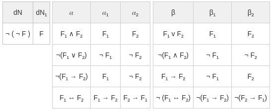

---
elm:
  source-directories:
    - ../../elm-sources/src
  dependencies:
      elm/browser: latest
      elm/core: latest
      elm/file: latest
      elm/html: latest
      elm/parser: latest
      elm-community/graph: latest
      elm-community/list-extra: latest
      elm-community/maybe-extra: latest
      munksgaard/char-extra: latest
      gicentre/elm-vegalite: latest
      avh4/elm-fifo: latest
      elm/bytes: latest
      elm/json: latest
      elm/time: latest
      elm/url: latest
      elm/virtual-dom: latest
      elm-community/intdict: latest
      Chadtech/elm-bool-extra: latest
---

<!-- Cargamos algunas funciones js que necesitamos -->

<script src="../js/d3.min.js"></script>
<script src="../js/viz.js" type="javascript/worker"></script>
<script src="../js/d3-graphviz.js"></script>
<script type="text/javascript">

    function plotDot(graphId){
        d3.select('#svgContainer' + graphId)
        .graphviz()
        .renderDot(document.getElementById("inDOT" + graphId).value.replace(/\\n/g, "\n").replace(/\\"/gm, '"'));

        document.getElementById("outputGraph" + graphId).style.display = "inline-block";
        document.getElementById("inputGraph" + graphId).style.display = "none";
    };

    function generatePng(graphId){
        var svgElement = document.getElementById('svgContainer' + graphId).querySelector('svg');
        var svgString = new XMLSerializer().serializeToString(svgElement);
        var canvas = document.getElementById("canvas" + graphId);
        canvas.width = svgElement.getBBox().width*1.33;
        canvas.height = svgElement.getBBox().height*1.33;
        var ctx = canvas.getContext("2d");
        var DOMURL = self.URL || self.webkitURL || self;
        var img = new Image();
        var svg = new Blob([svgString], {type: "image/svg+xml;charset=utf-8"});
        var url = DOMURL.createObjectURL(svg);
        img.onload = function() {
            ctx.drawImage(img, 0, 0);
            var png = canvas.toDataURL("image/png");

            document.querySelector("#pngContainer" + graphId).innerHTML = '<a id="downloadPNG'+ graphId +'" href="'+png+'" download/> PNG Image </a>';
            imgdownload = document.getElementById("downloadPNG"+ graphId)
            imgdownload.click();
            DOMURL.revokeObjectURL(png);
        };
        img.src = url;
    };
</script>


## **TEMA 2 - PARTE 2**
Tableros Semánticos II
====================

2.3. Tableros Semánticos en Lógica de Primer Orden
--------------------------------------------

El mismo método que hemos planteado para LP es extensible a LP, realizando algunas adaptaciones en el método.

Recordemos que LPO es una lógica que extiende a LP, posibilitando el uso de cuantificadores e introduciendo otros elementos de forma que podemos establecer una relación estrecha entre los elementos de LP y los de LPO:

<table style="margin-left: auto; margin-right: auto; width: 450px; border-collapse:collapse;border-color:#ccc;border-spacing:0" class="tg"><thead><tr><th style="background-color:#f0f0f0;border-color:inherit;border-style:solid;border-width:0px;color:#333;font-family:Arial, sans-serif;font-size:14px;font-weight:normal;overflow:hidden;padding:10px 5px;text-align:center;vertical-align:top;word-break:normal">Elementos LP<br></th><th style="background-color:#f0f0f0;border-color:inherit;border-style:solid;border-width:0px;color:#333;font-family:Arial, sans-serif;font-size:14px;font-weight:normal;overflow:hidden;padding:10px 5px;text-align:center;vertical-align:top;word-break:normal">Elementos LPO<br></th></tr></thead><tbody><tr><td style="background-color:#fff;border-color:inherit;border-style:solid;border-width:0px;color:#333;font-family:Arial, sans-serif;font-size:14px;overflow:hidden;padding:10px 5px;text-align:center;vertical-align:top;word-break:normal">Símbolos proposicionales<br></td><td style="background-color:#fff;border-color:inherit;border-style:solid;border-width:0px;color:#333;font-family:Arial, sans-serif;font-size:14px;overflow:hidden;padding:10px 5px;text-align:center;vertical-align:top;word-break:normal">Términos: Variables,<br>constantes y funciones</td></tr><tr><td style="background-color:#fff;border-color:inherit;border-style:solid;border-width:0px;color:#333;font-family:Arial, sans-serif;font-size:14px;overflow:hidden;padding:10px 5px;text-align:center;vertical-align:top;word-break:normal">Átomos: Variables proposicionales</td><td style="background-color:#fff;border-color:inherit;border-style:solid;border-width:0px;color:#333;font-family:Arial, sans-serif;font-size:14px;overflow:hidden;padding:10px 5px;text-align:center;vertical-align:top;word-break:normal">Predicados<br></td></tr><tr><td style="background-color:#fff;border-color:inherit;border-style:solid;border-width:0px;color:#333;font-family:Arial, sans-serif;font-size:14px;overflow:hidden;padding:10px 5px;text-align:center;vertical-align:top;word-break:normal">Conectivas : ¬, ∧, ∨, ⟶, ⟷</td><td style="background-color:#fff;border-color:inherit;border-style:solid;border-width:0px;color:#333;font-family:Arial, sans-serif;font-size:14px;overflow:hidden;padding:10px 5px;text-align:center;vertical-align:top;word-break:normal">Conectivas : ¬, ∧, ∨, ⟶, ⟷</td></tr><tr><td style="background-color:#fff;border-color:inherit;border-style:solid;border-width:0px;color:#333;font-family:Arial, sans-serif;font-size:14px;overflow:hidden;padding:10px 5px;text-align:center;vertical-align:top;word-break:normal"></td><td style="background-color:#fff;border-color:inherit;border-style:solid;border-width:0px;color:#333;font-family:Arial, sans-serif;font-size:14px;overflow:hidden;padding:10px 5px;text-align:center;vertical-align:top;word-break:normal">Cuantificadores : ∀, ∃ </td></tr></tbody></table>

De forma que el método que hemos visto en LP es extensible, casi de manera directa, estableciendo la relación entre los elementos correspondientes y definiendo el modo de actuación ante los cuantificadores (fórmulas $\gamma$ y $\delta$).

De manera que podemos dividir, de forma análoga a como se ha visto para LP, el algoritmo en 2 pasos: la clasificación de fórmulas y las reglas de reducción.

### Clasificación de Fórmulas en LPO.

#### Fórmulas $dN$, $\alpha$ y $\beta$

Corresponden exactamente a la analogía entre LP y LPO presentada en la tabla anterior, de forma que:

<center> </center><br>

#### Fórmulas $\gamma$

Esta categoría engloba a todas aquellas fórmulas que se comportan como universales ($F \equiv \forall x \, G$), y de las cuales se obtienen infinitas componentes que resultan de las posibles sustituciones de términos cerrados posibles en el mundo en $G$, $(G\{x/t\})$, de forma que la satisfactibilidad de la fórmula original se reduce a la satisfactibilidad de todas las componentes simultáneamenete, no neesariamente finitas. Son fórmulas tipo $\gamma$:

<table style="width: 260px; margin:auto; border-collapse:collapse;border-color:#ccc;border-spacing:0" class="tg"><thead><tr><th style="background-color:#f0f0f0;border-color:#ccc;border-style:solid;border-width:1px;color:#333;font-family:Arial, sans-serif;font-size:14px;font-weight:bold;overflow:hidden;padding:10px 5px;text-align:center;vertical-align:top;word-break:normal">Fórmula 𝛾</th><th style="background-color:#f0f0f0;border-color:#ccc;border-style:solid;border-width:1px;color:#333;font-family:Arial, sans-serif;font-size:14px;font-weight:bold;overflow:hidden;padding:10px 5px;text-align:center;vertical-align:top;word-break:normal">Componentes (𝛾ₜ)</th></tr></thead><tbody><tr><td style="background-color:#fff;border-color:#ccc;border-style:solid;border-width:1px;color:#333;font-family:Arial, sans-serif;font-size:14px;overflow:hidden;padding:10px 5px;text-align:center;vertical-align:top;word-break:normal">∀x F</td><td style="background-color:#fff;border-color:#ccc;border-style:solid;border-width:1px;color:#333;font-family:Arial, sans-serif;font-size:14px;overflow:hidden;padding:10px 5px;text-align:center;vertical-align:top;word-break:normal">F{x/t} (t término cerrado)</td></tr><tr><td style="background-color:#fff;border-color:#ccc;border-style:solid;border-width:1px;color:#333;font-family:Arial, sans-serif;font-size:14px;overflow:hidden;padding:10px 5px;text-align:center;vertical-align:top;word-break:normal">¬ ∃x F</td><td style="background-color:#fff;border-color:#ccc;border-style:solid;border-width:1px;color:#333;font-family:Arial, sans-serif;font-size:14px;overflow:hidden;padding:10px 5px;text-align:center;vertical-align:top;word-break:normal">¬ F{x/t} (t término cerrado)</td></tr></tbody></table>

#### Fórmulas $\delta$

Esta categoría engloba a todas aquellas fórmulas que se comportan como existenciales ($F \equiv \exists x \, G$), y de las cuales se obtienen una única componente que resulta de la sustitución de una nueva constante en el mundo en $G$, $(G\{x/a\})$, de forma que la satisfactibilidad de la fórmula original se reduce a la satisfactibilidad de alguna de sus componentes $\delta_a$, para alguna nueva constante $a$. Son fórmulas tipo $\delta$:

<table style="width:268px; margin:auto; border-collapse:collapse;border-color:#ccc;border-spacing:0" class="tg"><thead><tr><th style="background-color:#f0f0f0;border-color:#ccc;border-style:solid;border-width:1px;color:#333;font-family:Arial, sans-serif;font-size:14px;font-weight:bold;overflow:hidden;padding:10px 5px;text-align:center;vertical-align:top;word-break:normal">Fórmula δ</th><th style="background-color:#f0f0f0;border-color:#ccc;border-style:solid;border-width:1px;color:#333;font-family:Arial, sans-serif;font-size:14px;font-weight:bold;overflow:hidden;padding:10px 5px;text-align:center;vertical-align:top;word-break:normal">Componentes (δₐ)</th></tr></thead><tbody><tr><td style="background-color:#fff;border-color:#ccc;border-style:solid;border-width:1px;color:#333;font-family:Arial, sans-serif;font-size:14px;overflow:hidden;padding:10px 5px;text-align:center;vertical-align:top;word-break:normal">∃x F</td><td style="background-color:#fff;border-color:#ccc;border-style:solid;border-width:1px;color:#333;font-family:Arial, sans-serif;font-size:14px;overflow:hidden;padding:10px 5px;text-align:center;vertical-align:top;word-break:normal">F{x/a} (a nueva constante)</td></tr><tr><td style="background-color:#fff;border-color:#ccc;border-style:solid;border-width:1px;color:#333;font-family:Arial, sans-serif;font-size:14px;overflow:hidden;padding:10px 5px;text-align:center;vertical-align:top;word-break:normal">¬ ∀x F</td><td style="background-color:#fff;border-color:#ccc;border-style:solid;border-width:1px;color:#333;font-family:Arial, sans-serif;font-size:14px;overflow:hidden;padding:10px 5px;text-align:center;vertical-align:top;word-break:normal">¬ F{x/a} (a nueva constante)</td></tr></tbody></table>

### Reglas de Reducción en LPO.

#### Reglas $dN$, $\alpha$ y $\beta$

Equivalentes a las expuestas para LP.

> Si $(F \equiv \neg \neg G) \in U$, entonces $U$ es satisfactible si y sólo si lo es $(U - \{F\}) \cup \{G\}$. Denotaremos la aplicación de esta regla sobre un conjunto $U$, dada una fórmula $F$ como $dN(U,F)$.

> Si $F \in U$ es de tipo $\alpha$, entonces $U$ es satisfactible si y sólo si lo es $(U - \{F\}) \cup \{\alpha_1, \alpha_2\}$. Denotaremos la aplicación de esta regla sobre un conjunto $U$, dada una fórmula $F$ como $\alpha(U,F)$.

> Si $F \in U$ es de tipo $\beta$, entonces $U$ es satisfactible si y sólo si lo es $(U - \{F\}) \cup \{\beta_1\}$ o lo es $(U - \{F\}) \cup \{\beta_2\}$. Denotaremos la aplicación de esta regla sobre un conjunto $U$, dada una fórmula $F$ como $\beta(U,F)$, siendo $\beta(U,F)_1 = (U - \{F\}) \cup \{\beta_1\}$ y $\beta(U,F)_2 = (U - \{F\}) \cup \{\beta_2\}$

#### Regla $ \gamma$

> Si $F \in U$ es de tipo $\gamma$, entonces $U$ es satisfactible si y sólo si lo es $(U \cup \{\gamma_t : t \textrm{ término cerrado }\}$ es consistente. Denotaremos la aplicación de esta regla sobre un conjunto $U$, dada una fórmula $F$ como $\gamma(U,F\{x/t\})$.

#### Regla $ \gamma$

> Si $F \in U$ es de tipo $\delta$, entonces $U$ es satisfactible si y sólo si lo es $((U - \{F\}) \cup \{\delta_a\}$ ($a$ nueva constante) es consistente. Denotaremos la aplicación de esta regla sobre un conjunto $U$, dada una fórmula $F$ como $\delta(U,F\{x/a\})$.

### Algoritmo de Tableros en LPO (Tableros completos)

Un **tablero** para un conjunto de fórmulas $U = \{F_1, \ldots, F_n\}$ es un árbol $T$, con nodos etiquetados con fórmulas, construido siguiendo el siguiente esquema:

1. Se construye un árbol, con nodos las fórmulas de U, de forma que se toma una como raíz (la primera), y se añaden el resto, de mandera sucesiva como hijos de la anterior. $$\begin{array}{c} F_1 \\ | \\ F_2 \\ | \\ \vdots \\ | \\ F_n \end{array}$$


2. Si quedan ramas en $T$ no marcadas (ni abiertas ni cerradas), tomar una de ellas $T_{br}$:
    2.1. Si la rama contiene una contradicción, esto es, dos fórmulas tal que una sea la negación de la otra o bien una fórmula insatisfactible ($\perp$ o $\neg (t = t)$), entonces marcar la **hoja** como **cerrada** ("╳").
    2.2. Si no, si hay en $T_m$ una fórmula **usable en m**, $A$ (de acuerdo a la siguiente prioridad):
      - Si $A$ es de tipo $dN$, entonces asignar como hijo de $h$ (hoja de la rama), el nodo etiquetado con $dN(A)$, de forma que $U$ es ahora $U' = dN(U, A)$.Marcar $A$ como <u>no usable en m</u>.
      - Si $A$ es de tipo $\alpha$, entonces asignar como hijo de $h$ (hoja de la rama) el nodo etiquetado con $\alpha_1(F)$, y como hijo de éste el nodo $\alpha_2 (F)$.Marcar $A$ como <u>no usable en m</u>.
      - Si $A$ es de tipo $\beta$, entonces asignar como hijos de $h$ (hoja de la rama) los nodos etiquetados con $\beta_1(A)$ y $\beta_2(A)$.Marcar $A$ como <u>no usable en m</u>.
      - Si $A$ es de tipo $\delta$, entonces asignar como hijo de $h$ (hoja de la rama) el nodo etiquetado con $\delta_a(F)$, introduciendo una nueva constante $a$. Marcar $A$ como <u>no usable en m</u>.
      - Si $A$ es de tipo $\gamma$, entonces asignar como hijo de $h$ (hoja de la rama) el nodo etiquetado con $\gamma_t(F)$, donde $t$ es un término cerrado del tablero, si no existe ninguno se introduce una nueva constante. NO marcar $A$ como <u>no usable en m</u> (las fórmulas $\gamma$ se pueden usar indefinidamente).

    2.3. En otro caso marcar la rama como abierta ("◯").


Se dice **tablero completo** a un tablero construido siguiendo las pautas anteriores y que no admite extensión, esto es, todas las ramas están marcadas.  Puede ocurrir que un tablero completo sea infinito (una rama puede crecer infinitamente).

Se dice **tablero cerrado** a aquél que tiene todas sus ramas cerradas. Se dice **tablero abierto** en caso contrario.

Es fácil razonar que todo tablero completo infinito es abierto, ya que toda rama infinita es imposible que contenga una hoja cerrada.

#### Teorema de Corrección y Completitud

> Dado un conjunto de fórmulas $S$ de fórmulas cerradas:
> 1. **Corrección**.Si $S$ admite un tablero completo y cerrado entonces $S$ es inconsistente.
> 2. **Completitud**. Si $S$ es inconsistente, entonces admite un tablero completo y cerrado.

Nótese que, a pesar del teorema anterior, el algoritmo presentado no garantiza la finalización, luego, tal y como presentamos en el primer tema, el problema de satisfactibilidad en LPO no es decidible.

#### Búsqueda de modelos.

Dado el *Teorema de Corrección y Completitud*, un conjunto de fórmulas $S$ admite un tablero completo abierto si y sólo si $S$ es consistente. De forma que cada una de las ramas abiertas $m$ (conjuntos de literales no contradictorios) proporciona, al menos, un modelo (no necesariamente distinto) de $S$, de forma que el modelo corresponde a una $L$-estructura tal que el universo corresponde a un conjunto (no necesariamente finito) que contiene las interpretaciones de términos cerrados que aparecen en la rama, y las interpretaciones de los predicados contendrá aquellas secuencias de términos (según la aridad) tal que el predicado aparece (en forma positiva) en la rama o, al menos, no aparece en forma negativa.

#### Consecuencia lógica.

Dada la relación (vista en el tema 1) entre conseciencia lógica e inconsistencia de conjuntos: $$ U \models F \Leftrightarrow (U \cup \{ \neg F\}) \textrm{ es inconsistente}$$

Es sencillo probar la consecuencia lógica sin más reducirlo a la obtención de un tablero cerrado del conjunto, debidamente formado. De forma se tendrá dicha consecuencia si y sólo si el tablero (completo) es cerrado.

### Tableros Semánticos LPO en Logicus.  

El módulo *Logicus.SemanticBoardsLP* se ha implementado el método de los tableros semánticos, tanto su desarrollo como su representación gráfica en forma de árbol. De forma que se han seguido los conceptos presentados en los apartados anteriores de forma que:

#### Tipos de fórmulas: $dN, \alpha, \beta, \gamma, \delta, \perp$ y literales

    isInsat : FormulaLPO -> Bool
    isInsat x =
        case x of
            Insat -> True
            Neg (Insat) -> True
            Neg (Equal t1 t2) -> t1 == t2
            _ -> False

    isLiteral : FormulaLPO -> Bool
    isLiteral x =
        case x of
            Pred _ _ -> True
            Neg (Pred _ _) -> True
            Equal _ _ -> True
            Neg (Equal t1 t2) -> t1 /= t2
            _ -> False

    isDobleNeg : FormulaLPO -> Bool
    isDobleNeg x =
        case x of
            Neg ( Neg ( _ ) ) -> True
            _ -> False


    isAlpha : FormulaLPO -> Bool
    isAlpha x =
        case x of
            Conj _ _ -> True
            Neg (Disj _ _) -> True
            Neg (Impl _ _) -> True
            Equi _ _ -> True
            _ -> False

    isBeta : FormulaLPO -> Bool
    isBeta x =
        case x of
            Disj _ _ -> True
            Impl _ _ -> True
            Neg (Conj _ _) -> True
            Neg (Equi _ _) -> True
            _ -> False

    isGamma : FormulaLPO -> Bool
    isGamma x =
        case x of
            Forall _ _ -> True
            Neg (Exists _ _) -> True
            _ -> False

    isDelta : FormulaLPO -> Bool
    isDelta x =
        case x of
            Exists _ _ -> True
            Neg (Forall _ _) -> True
            _ -> False
#### Componentes de las fórmulas

    formuladNComponents : FormulaLPO -> Maybe (FormulaLPO)
    formuladNComponents x =
        case x of
            Neg (Neg f) -> Just f
            _ -> Nothing

    formulaAlphaBetaComponents : FormulaLPO -> Maybe (FormulaLPO, FormulaLPO)
    formulaAlphaBetaComponents x =
        case x of                                   
            Conj f g -> Just (f, g)
            Neg (Impl f g) -> Just (f, Neg g)
            Neg (Disj f g) -> Just (Neg f, Neg g)
            Disj f g -> Just (f, g)
            Impl f g -> Just (Neg f , g)
            Neg (Conj f g) -> Just (Neg f, Neg g)
            Equi f g -> Just (Impl f g, Impl g f)
            Neg (Equi f g) -> Just (Neg(Impl f g), Neg(Impl g f))
            _ -> Nothing

    formulaGammaDeltaComponents : FormulaLPO -> Term -> Maybe (FormulaLPO)
    formulaGammaDeltaComponents x t =
        case x of
            Forall v f -> Just <| applySubsToFormula (Dict.fromList [(getVarSymb v, t)]) f
            Neg (Exists v f) -> Just <| Neg <| applySubsToFormula (Dict.fromList [(getVarSymb v, t)]) f
            Exists v f -> Just <| applySubsToFormula (Dict.fromList [(getVarSymb v, t)]) f
            Neg (Forall v f) -> Just <| Neg <| applySubsToFormula (Dict.fromList [(getVarSymb v, t)]) f
            _ -> Nothing

#### Algoritmo de Tableros LPO

    makeSBoard : List FormulaLPO -> Int -> List Term -> String
    makeSBoard fs  pmax m =
        let myStyles =
                { defaultStyles | node = "shape=box, color=black", edge = "dir=none, color=blue, fontcolor=blue"}
            sbnodes = List.foldl (\ f ac -> ac ++ [Node (List.length ac) (toStringFLPO f)]) [] fs
            sbedges = List.map (\ x -> Edge x (x+1) "") <| List.range 0 ((List.length fs)-1)
            dictfs = Dict.fromList <| List.map (\ x -> (x , (clasifyFormula (Maybe.withDefault Insat <| List.Extra.getAt x fs), 0))) <| List.range 0 ((List.length fs)-1)
        in
            String.replace "\n\n" "\n" <| outputWithStyles myStyles (\x -> Just x) (\x-> Just x) <|  uncurry fromNodesAndEdges <| makeSBoardAux fs dictfs m pmax ((List.length fs)-1) (sbnodes, sbedges)


    makeSBoardAux : List FormulaLPO -> Dict Int (Int, Int) -> List Term -> Int -> NodeId -> (List (Node String), List (Edge String)) -> (List (Node String), List (Edge String))
    makeSBoardAux fs dictfs m pmax nidp (sbnodes, sbedges) =
        let
            nid = List.length sbnodes
        in
            if pmax == 0 then
                (sbnodes ++ [Node nid "◯"], sbedges ++ [Edge  nidp  nid ""])
            else
                case List.head <| Dict.keys <| Dict.filter (\ _ (v1, v2) -> v1 == 0 && v2 == 0) dictfs of
                    Just i ->
                        let
                            f = Maybe.withDefault Insat <| formuladNComponents <| Maybe.withDefault Insat <| List.Extra.getAt i fs
                            edgeLabel = "dN : 『" ++  String.fromInt (i+1) ++ "』"
                        in
                            let
                                newsbnodes = sbnodes ++ [Node nid (toStringFLPO f)]
                                newsbedges = sbedges ++ [Edge  nidp  nid edgeLabel]
                                newfs = fs ++ [f]
                                newdictfs = Dict.insert i (0, 1) <| Dict.insert ((List.length newfs)-1) (clasifyFormula f, 0) dictfs
                            in
                                if isInsat f || List.any (\x -> x ==  Maybe.withDefault (Neg f) (formuladNComponents (Neg f))) fs then
                                    (newsbnodes ++ [Node (nid + 1) "╳"], newsbedges ++ [Edge  nid  (nid + 1) ""])
                                else
                                    makeSBoardAux newfs  newdictfs m (pmax-1) nid (newsbnodes, newsbedges)
                    Nothing ->
                        case List.head <| Dict.keys <| Dict.filter (\ _ (v1, v2) -> v1 == 1 && v2 == 0) dictfs of
                            Just i ->
                                let
                                    (f, g) = Maybe.withDefault (Insat, Insat) <| formulaAlphaBetaComponents <| Maybe.withDefault Insat <| List.Extra.getAt i fs
                                    edgeLabelf = "α₁ :『" ++  String.fromInt (i+1) ++ "』"
                                    edgeLabelg = "α₂ :『" ++  String.fromInt (i+1) ++ "』"

                                in
                                    let
                                        newsbnodes = sbnodes ++ [Node nid (toStringFLPO f), Node (nid + 1) (toStringFLPO g)]
                                        newsbedges = sbedges ++ [Edge  nidp  nid edgeLabelf, Edge  nid (nid + 1) edgeLabelg]
                                        newfs = fs ++ [f, g]
                                        newdictfs =
                                            Dict.insert i (1, 1)
                                                <| Dict.insert ((List.length newfs)-2) (clasifyFormula f, 0)
                                                <| Dict.insert ((List.length newfs)-1) (clasifyFormula g, 0) dictfs
                                    in
                                        if isInsat f || isInsat g || List.any (\x -> x == Maybe.withDefault (Neg f) (formuladNComponents (Neg f)) || x == Maybe.withDefault (Neg f) (formuladNComponents (Neg g))) fs  then
                                            (newsbnodes ++ [Node (nid + 2) "╳"], newsbedges ++ [Edge  (nid+1)  (nid + 2) ""])
                                        else
                                            makeSBoardAux newfs  newdictfs m (pmax-1) nid (newsbnodes, newsbedges)

                            Nothing ->
                                case List.head <| Dict.keys <| Dict.filter (\ _ (v1, v2) -> v1 == 2 && v2 == 0) dictfs of
                                    Just i ->
                                        let
                                            (f, g) = Maybe.withDefault (Insat, Insat) <| formulaAlphaBetaComponents <| Maybe.withDefault Insat <| List.Extra.getAt i fs
                                            edgeLabelf = "β₁ :『" ++  String.fromInt (i+1) ++ "』"
                                            edgeLabelg = "β₂ :『" ++  String.fromInt (i+1) ++ "』"

                                        in

                                            let
                                                newsbnodes1 = sbnodes ++ [Node nid (toStringFLPO f)]
                                                newsbedges1 = sbedges ++ [Edge  nidp  nid edgeLabelf]
                                                newfs1 = fs ++ [f]
                                                newdictfs1 =
                                                    Dict.insert i (2, 1)
                                                        <| Dict.insert ((List.length newfs1)-1) (clasifyFormula f, 0) dictfs
                                            in
                                                let
                                                    (sbnodes2, sbedges2) =
                                                        if isInsat f || List.any (\x -> x == Maybe.withDefault (Neg f) (formuladNComponents (Neg f))) fs  then
                                                            (newsbnodes1 ++ [Node (nid + 1) "╳"], newsbedges1 ++ [Edge  nid (nid + 1) ""])
                                                        else
                                                            makeSBoardAux newfs1 newdictfs1 m (pmax-1) nid (newsbnodes1, newsbedges1)
                                                in
                                                    let
                                                        nid2 = List.length sbnodes2
                                                    in
                                                        let
                                                            newsbnodes2 = sbnodes2 ++ [Node nid2 (toStringFLPO g)]  
                                                            newsbedges2 = sbedges2 ++ [Edge  nidp  nid2 edgeLabelg]
                                                            newfs2 = fs ++ [g]
                                                            newdictfs2 =
                                                                Dict.insert i (2, 1)
                                                                    <| Dict.insert ((List.length newfs2)-1) (clasifyFormula g, 0) dictfs

                                                        in
                                                            if isInsat g || List.any (\x -> x == Maybe.withDefault (Neg g) (formuladNComponents (Neg g))) fs  then
                                                                (newsbnodes2 ++ [Node (nid2 + 1) "╳"], newsbedges2 ++ [Edge  nid2 (nid2 + 1) ""])
                                                            else
                                                                makeSBoardAux newfs2 newdictfs2 m (pmax-1) nid2 (newsbnodes2, newsbedges2)
                                    Nothing ->
                                        case  List.head <| Dict.keys <| Dict.filter (\ _ (v1, v2) -> v1 == 4 && v2 == 0) dictfs of
                                            Just i ->
                                                let
                                                    newC = generateNewConstant 1 m
                                                    f = Maybe.withDefault Insat <| formulaGammaDeltaComponents (Maybe.withDefault Insat <| List.Extra.getAt i fs) newC
                                                    edgeLabel = "δ : 『" ++  String.fromInt (i+1) ++ " / " ++ toStringTerm newC ++"』"
                                                in
                                                    let
                                                        newsbnodes = sbnodes ++ [Node nid (toStringFLPO f)]
                                                        newsbedges = sbedges ++ [Edge  nidp  nid edgeLabel]
                                                        newfs = fs ++ [f]
                                                        newdictfs = Dict.insert i (4, 1) <| Dict.insert ((List.length newfs)-1) (clasifyFormula f, 0) dictfs
                                                    in
                                                        if isInsat f || List.any (\x -> x == Maybe.withDefault (Neg f) (formuladNComponents (Neg f))) fs then
                                                            (newsbnodes ++ [Node (nid + 1) "╳"], newsbedges ++ [Edge  nid  (nid + 1) ""])
                                                        else
                                                            makeSBoardAux newfs newdictfs (uniqueConcatList (m ++ [newC]) (constantTermsInFormula f)) (pmax-1) nid (newsbnodes, newsbedges)
                                            Nothing ->
                                                case  List.head <| List.sortBy (\ (_,(_, v2)) -> v2) <| Dict.toList <| Dict.filter (\ _ (v1, _) -> v1 == 3) dictfs of
                                                    Just (i, (_, iv)) ->
                                                        let
                                                            (nm, cs) =
                                                                case List.Extra.getAt iv m of
                                                                    Just c -> (m, c)

                                                                    Nothing ->
                                                                        let newC = generateNewConstant 1 m in
                                                                            (m ++ [newC], newC)
                                                        in
                                                            let
                                                                f = Maybe.withDefault Insat <| formulaGammaDeltaComponents (Maybe.withDefault Insat <| List.Extra.getAt i fs) cs
                                                                edgeLabel = "𝛾 : 『" ++  String.fromInt (i+1) ++ " / " ++ toStringTerm cs ++"』"
                                                            in
                                                                let
                                                                    newsbnodes = sbnodes ++ [Node nid (toStringFLPO f)]
                                                                    newsbedges = sbedges ++ [Edge  nidp  nid edgeLabel]
                                                                    newfs = fs ++ [f]
                                                                    newdictfs = Dict.insert i (3, iv + 1) <| Dict.insert ((List.length newfs)-1) (clasifyFormula f, 0) dictfs
                                                                in
                                                                    if isInsat f || List.any (\x -> x == Maybe.withDefault (Neg f) (formuladNComponents (Neg f))) fs then
                                                                        (newsbnodes ++ [Node (nid + 1) "╳"], newsbedges ++ [Edge  nid  (nid + 1) ""])
                                                                    else
                                                                        makeSBoardAux newfs newdictfs (uniqueConcatList nm (constantTermsInFormula f)) (pmax-1) nid (newsbnodes, newsbedges)
                                                    Nothing -> (sbnodes ++ [Node nid "◯"], sbedges ++ [Edge  nidp  nid ""])

$-$ Funciones auxiliares

    clasifyFormula : FormulaLPO -> Int
    clasifyFormula x =
        if isDobleNeg x then 0
        else if isAlpha x then 1
        else if isBeta x then 2
        else if isGamma x then 3
        else if isDelta x then 4
        else 5

    constantTermsInFormula : FormulaLPO -> List(Term)
    constantTermsInFormula x =
        case x of
            Pred _ terms -> List.filter (\ t -> List.isEmpty <| varsInTerm t) terms
            Equal t1 t2 -> List.filter (\ t -> List.isEmpty <| varsInTerm t) [t1, t2]
            Neg p -> constantTermsInFormula p
            Conj p q -> uniqueConcatList (constantTermsInFormula p) (constantTermsInFormula q)
            Disj p q -> uniqueConcatList (constantTermsInFormula p) (constantTermsInFormula q)
            Impl p q -> uniqueConcatList (constantTermsInFormula p) (constantTermsInFormula q)
            Equi p q -> uniqueConcatList (constantTermsInFormula p) (constantTermsInFormula q)
            Exists _ p -> constantTermsInFormula p
            Forall _ p -> constantTermsInFormula p
            Insat -> []

    generateNewConstant : Int -> List Term -> Term
    generateNewConstant i ls =
        let name = "c" ++ String.fromInt i in
            if List.member (Func name []) ls then
                generateNewConstant (i+1) ls
            else
                Func name []

#### Ejemplos de aplicación de Tableros Semánticos en LPO

Los conceptos (teóricos y prácticos) que hemos desarrollado previamente nos permiten trabajar con el Método de Tableros Semánticos para su aplicación a la satisfactibilidad de conjuntos en LPO. A continuación, se muestran algunos ejemplos (en forma de ejercicios resueltos) con el fin de afianzar los conceptos vistos durante esta segunda parte del tema:


##### Ejemplo 1
> Decide, utilizando tableros semánticos, cuáles de los siguientes conjuntos de fórmulas son consistentes ($P,Q$ y $R$ son predicados de la aridad correcta). Dar un modelo para cada uno de los conjuntos satisfactibles:
> 1. $\{\exists x \, Q(x), \forall x \, (Q(x) \rightarrow R(x)), \forall x \, \neg R(x)\}$
> 2. $\{\exists y \, \forall x \, P(x,y), \forall x \, \neg P(x,x)\}$
> 3. $\{\forall x \, \forall y \, (P(x,y) \rightarrow P(y,x)), \forall x \, P(x,x), \exist x \, \exists y \, P(x,y)\}$
> 4. $\{\forall x \, \exists y \, P(x,y), \forall x \neg P(x,x)\}$

***Solución (usando Logicus)***

<u>Apartado 1</u>

Teniendo en cuenta el Teorema de Compacidad y Completitud, podemos reducir la satisfactibilidad del conjunto a la construcción de un tablero completo.

Dado que los tableros pueden ser infinitos, computacionalmente en *Logicus* se han acotado de forma que la cota corresponde a la profundidad del árbol (sin tener en cuenta las fórmulas del conjunto inicial) de forma que para generar el árbol utilizando la herramienta, con profundidad 10 y como no aparece ningún término cerrado en nuestras fórmulas, comenzaremos con el mundo vacío:

```elm {l context="3"}

import Logicus.IO_LPO exposing (..)
import Logicus.SintaxSemanticsLPO exposing (..)
import Logicus.SemanticBoardsLPO exposing (..)
import Logicus.AuxForLitvis exposing (..)

u1 : SetLPO
u1 =  List.map (\x -> fromStringToFLPO x |> extractReadFLPO)["EXISTS{x} Q[x;]","FORALL{x} (Q[x;] IMPLIES R[x;])", "FORALL{x} NOT R[x;]"]

tablero_u1 : String
tablero_u1  = makeSBoard u1 10 []

-- Ejecutamos: showGraphViz "T7" tablero_u1
```

^^^elm {m=(showGraphViz "T7" tablero_u1) context="3"}^^^

De forma que el tablero sale cerrado, y por tanto el conjunto es inconsistente

<u>Apartado 2</u>

De forma análoga al caso anterior:

```elm {l context="3"}
u2 : SetLPO
u2 =  List.map (\x -> fromStringToFLPO x |> extractReadFLPO)["EXISTS{y}FORALL{x} P[x;y;]","FORALL{x} NOT P[x;x;]"]

tablero_u2 : String
tablero_u2  = makeSBoard u2 10 []

-- Ejecutamos: showGraphViz "T8" tablero_u2
```

^^^elm {m=(showGraphViz "T8" tablero_u2) context="3"}^^^

De nuevo, el tablero nos sale cerrado, por tanto el conjunto es inconsistente.

<u>Apartado 3</u>

Operando del mismo modo que en los casos anteriores:

```elm {l context="3"}
u3 : SetLPO
u3 =  List.map (\x -> fromStringToFLPO x |> extractReadFLPO)[
  "FORALL{x} FORALL{y} (P[x;y;] IMPLIES P[y;x;])",
  "FORALL{x} (P[x;x;])",
  "EXISTS{x} EXISTS{y} (P[x;y;])"]

tablero_u3 : String
tablero_u3 = makeSBoard u3 14 []

-- Ejecutamos: showGraphViz "T9" tablero_u3
```

^^^elm {m=(showGraphViz "T9" tablero_u3) context="3"}^^^

En este caso con cota 10 podemos ver que el tablero sale abierto. Ahora tenemos dos alternativas:

1. Intentar dar un modelo, de forma que el conjunto sea satisfactible.
2. En caso de poder obtenerlo, utilizar una cota mayor para intentar encontrar un tablero cerrado.

De hecho podemos dar varios mundos (más bien $L$-estructuras) en los que el conjunto es satisfactible. De la rama abierta, podemos obtener la siguiente información:

$$\begin{array}{l} M = \{c1, c2\} \\ P = \{(c1,c1), (c1,c2), (c2, c1), (c2,c2)\} \end{array}$$

De forma que un mundo fácilmente extraíble es por ejemplo un mundo cuyos elementos son el $\{0,2\}$ y $P(x,y)$ denota si $x-y$ es par.

De hecho, podemos plantear otros modelos, otro por ejemplo es un modelo con un único elemento ${0}$ y $P$ corresponde a la igualdad. O incluso un modelo con un universo infinito, p.e. $M =\mathbb{Z}$ y $P$ denota si $(x+y) \in \mathbb{Z}$.

Hemos dado al menos un modelo para el conjunto, luego por definición el conjunto es satisfactible, y por tanto no admite ningún tablero cerrado.

<u>Apartado 4</u>

El tablero para el conjunto correspondería a:

```elm {l context="3"}
u4 : SetLPO
u4 =  List.map (\x -> fromStringToFLPO x |> extractReadFLPO)[
  "FORALL {x} EXISTS {y} P[x;y;]",
  "FORALL{x} NOT P[x;x;]"]

tablero_u4 : String
tablero_u4 = makeSBoard u4 6 []

-- Ejecutamos: showGraphViz "T10" tablero_u4
```

^^^elm {m=(showGraphViz "T10" tablero_u4) context="3"}^^^

El tablero con dicha profundidad es abierto, razonemos. La rama nos permite fácilmente obtener un mundo infinito en el que es cierto, por ejemplo tengamos $M=\mathbb{N}$ y $P$ representa el predicado $x < y$, de forma que en efecto para todo elemento existe uno que es mayor (primera fórmula) y ningún elemento es mayor que sí mismo (segunda fórmula).

También podemos dar un mundo finito en el que el conjunto se satisface. Sea $M=\{0,1\}$ y $P$ representa $x \neq y$, de forma que, en efecto, para todo elemento existe uno que es distinto de él (primera fórmula) y ningún elemento es distinto de sí mismo (segunda fórmula).

Habiendo encontrado al menos un mundo en el que el conjunto se satisface, por definición, podemos decir que el conjunto es satisfactible.

$\boxed{Completar}$
