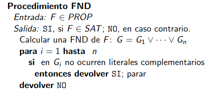
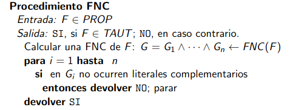

---
elm:
  source-directories:
    - ../../elm-sources/src
  dependencies:
      elm/browser: latest
      elm/core: latest
      elm/file: latest
      elm/html: latest
      elm/parser: latest
      elm-community/graph: latest
      elm-community/list-extra: latest
      elm-community/maybe-extra: latest
      munksgaard/char-extra: latest
      gicentre/elm-vegalite: latest
      avh4/elm-fifo: latest
      elm/bytes: latest
      elm/json: latest
      elm/time: latest
      elm/url: latest
      elm/virtual-dom: latest
      elm-community/intdict: latest
      Chadtech/elm-bool-extra: latest
---

<!-- Cargamos algunas funciones js que necesitamos -->

<script src="../js/d3.min.js"></script>
<script src="../js/viz.js" type="javascript/worker"></script>
<script src="../js/d3-graphviz.js"></script>
<script type="text/javascript">

    function plotDot(graphId){
        d3.select('#svgContainer' + graphId)
        .graphviz()
        .renderDot(document.getElementById("inDOT" + graphId).value.replace(/\\n/g, "\n").replace(/\\"/gm, '"'));

        document.getElementById("outputGraph" + graphId).style.display = "inline-block";
        document.getElementById("inputGraph" + graphId).style.display = "none";
    };

    function generatePng(graphId){
        var svgElement = document.getElementById('svgContainer' + graphId).querySelector('svg');
        var svgString = new XMLSerializer().serializeToString(svgElement);
        var canvas = document.getElementById("canvas" + graphId);
        canvas.width = svgElement.getBBox().width*1.33;
        canvas.height = svgElement.getBBox().height*1.33;
        var ctx = canvas.getContext("2d");
        var DOMURL = self.URL || self.webkitURL || self;
        var img = new Image();
        var svg = new Blob([svgString], {type: "image/svg+xml;charset=utf-8"});
        var url = DOMURL.createObjectURL(svg);
        img.onload = function() {
            ctx.drawImage(img, 0, 0);
            var png = canvas.toDataURL("image/png");

            document.querySelector("#pngContainer" + graphId).innerHTML = '<a id="downloadPNG'+ graphId +'" href="'+png+'" download/> PNG Image </a>';
            imgdownload = document.getElementById("downloadPNG"+ graphId)
            imgdownload.click();
            DOMURL.revokeObjectURL(png);
        };
        img.src = url;
    };
</script>


## **TEMA 3**
Formas Normales, Cláusulas y Algoritmo DPLL
====================

Descripción general del capítulo
--------------------------------

En el tema anterior estudiamos un algoritmo, *Tableros Semánticos*, basado en el manejo y transformación de los conjuntos de fórmulas en otros equivalentes más sencillos, tanto en LP como en LPO, para tratar de resolver la satisfactibilidad del conjunto.

En este tema nos vamos a centrar en otro algoritmo, que toma un conjunto de fórmulas, sobre las que se ha aplicado un preprocesamiento (forma clausal), reduciendo la satisfactibilidad del conjunto a la satisfactibilidad de las Cláusulas. Siendo este el algoritmo base para muchos de los métodos actuales que abordan el problema *SAT*,

### <u> Estructura del capítulo </u>

El capítulo se encuentra estructurado en distintas secciones, a través de las cuales se abordan los conceptos fundamentales para el trabajo con fórmulas equivalentes, reglas algebraicas, formas normales (FNC y FND), forma clausal y DPLL destinados al estudio del problema fundamental (satisfactibilidad de conjuntos) para la Lógica Proposicional.

Para el estudio práctico se hará uso de los módulos:

-   **Módulo NormalFormsDPLL**. Recoge la implementación de los métodos de transformación a FNC, FND, Cláusulas, y el Algoritmo DPLL para la Lógica Proposicional.

- Otros módulos auxiliares...


2.1. Introducción.
------------------

Como ya hemos señalado, en el tema anterior ya hicimos un uso implícito del concepto de **equivalencia** entre fórmulas, sin embargo no dimos una definición formal de cuando dos fórmulas son equivalentes:

> Dos fórmulas $F, G \in PROP$ son equivalentes, y se denota por $F \equiv G$ si y sólo si para toda valoración $v$ se tiene que $v(F)=v(G)$.

De forma que, son equivalentes a lo anterior:

  - $F$ y $G$ poseen, exactamente, los mismos modelos.
  - $F \equiv G$ si y sólo si $F \models G$ y $G \models F$
  - $F \leftrightarrow G$ es lógicamente válida.

Aunque hay infinidad de equivalencias entre fórmulas existen algunas, definidas de manera general, que forman parte de las conocidas como *reglas algebraicas LP*  o **reglas del álgebra proposicional**. Entre ellas destacamos:

<table style="margin: auto; width:390px;border-collapse:collapse;border-color:#ccc;border-spacing:0" class="tg"><thead><tr><th style="background-color:#656565;border-color:#9b9b9b;border-style:solid;border-width:1px;color:#ffffff;font-family:Arial, sans-serif;font-size:14px;font-style:italic;font-weight:bold;overflow:hidden;padding:10px 5px;text-align:center;text-decoration:underline;vertical-align:top;word-break:normal" colspan="2">Leyes del Álgebra Proposicional</th></tr></thead><tbody><tr><td style="background-color:#efefef;border-color:#9b9b9b;border-style:solid;border-width:1px;color:#333;font-family:Arial, sans-serif;font-size:14px;font-weight:bold;overflow:hidden;padding:10px 5px;text-align:center;vertical-align:top;word-break:normal">Conmutatividad<br></td><td style="background-color:#ffffff;border-color:#9b9b9b;border-style:solid;border-width:1px;color:#333;font-family:Arial, sans-serif;font-size:14px;overflow:hidden;padding:10px 5px;text-align:center;vertical-align:top;word-break:normal">F ∨ G ≡ G ∨ F<br>F ∧ G ≡ G ∧ F</td></tr><tr><td style="background-color:#efefef;border-color:#9b9b9b;border-style:solid;border-width:1px;color:#333;font-family:Arial, sans-serif;font-size:14px;font-weight:bold;overflow:hidden;padding:10px 5px;text-align:center;vertical-align:top;word-break:normal">Asocitividad</td><td style="background-color:#ffffff;border-color:#9b9b9b;border-style:solid;border-width:1px;color:#333;font-family:Arial, sans-serif;font-size:14px;overflow:hidden;padding:10px 5px;text-align:center;vertical-align:top;word-break:normal">F ∨ (G ∨ H) ≡ (F ∨ G) ∨ H<br>F ∧ (G ∧ H) ≡ (F ∧ G) ∧ H</td></tr><tr><td style="background-color:#efefef;border-color:#9b9b9b;border-style:solid;border-width:1px;color:#333;font-family:Arial, sans-serif;font-size:14px;font-weight:bold;overflow:hidden;padding:10px 5px;text-align:center;vertical-align:top;word-break:normal">Distributividad<br></td><td style="background-color:#ffffff;border-color:#9b9b9b;border-style:solid;border-width:1px;color:#333;font-family:Arial, sans-serif;font-size:14px;overflow:hidden;padding:10px 5px;text-align:center;vertical-align:top;word-break:normal">F ∧ (G ∨ H) ≡ (F ∧ G) ∨ (F ∧ H)<br>F ∨ (G ∧ H) ≡ (F ∨ G) ∧ (F ∨ H)</td></tr><tr><td style="background-color:#efefef;border-color:#9b9b9b;border-style:solid;border-width:1px;color:#333;font-family:Arial, sans-serif;font-size:14px;font-weight:bold;overflow:hidden;padding:10px 5px;text-align:center;vertical-align:top;word-break:normal">Doble Negación</td><td style="background-color:#ffffff;border-color:#9b9b9b;border-style:solid;border-width:1px;color:#333;font-family:Arial, sans-serif;font-size:14px;overflow:hidden;padding:10px 5px;text-align:center;vertical-align:top;word-break:normal">¬ ¬ F ≡F</td></tr><tr><td style="background-color:#efefef;border-color:#9b9b9b;border-style:solid;border-width:1px;color:#333;font-family:Arial, sans-serif;font-size:14px;font-weight:bold;overflow:hidden;padding:10px 5px;text-align:center;vertical-align:top;word-break:normal">De Morgan</td><td style="background-color:#ffffff;border-color:#9b9b9b;border-style:solid;border-width:1px;color:#333;font-family:Arial, sans-serif;font-size:14px;overflow:hidden;padding:10px 5px;text-align:center;vertical-align:top;word-break:normal">¬ (F ∨ G) ≡ ¬ F ∧ ¬ G<br>¬ (F ∧ G) ≡ ¬ F ∨ ¬ G</td></tr><tr><td style="background-color:#efefef;border-color:#9b9b9b;border-style:solid;border-width:1px;color:#333;font-family:Arial, sans-serif;font-size:14px;font-weight:bold;overflow:hidden;padding:10px 5px;text-align:center;vertical-align:top;word-break:normal">Idempotencia<br></td><td style="background-color:#ffffff;border-color:#9b9b9b;border-style:solid;border-width:1px;color:#333;font-family:Arial, sans-serif;font-size:14px;overflow:hidden;padding:10px 5px;text-align:center;vertical-align:top;word-break:normal">F ∨ F ≡ F <br> F ∧ F ≡ F</td></tr><tr><td style="background-color:#efefef;border-color:#9b9b9b;border-style:solid;border-width:1px;color:#333;font-family:Arial, sans-serif;font-size:14px;font-weight:bold;overflow:hidden;padding:10px 5px;text-align:center;vertical-align:top;word-break:normal">Absorción</td><td style="background-color:#ffffff;border-color:#9b9b9b;border-style:solid;border-width:1px;color:#333;font-family:Arial, sans-serif;font-size:14px;overflow:hidden;padding:10px 5px;text-align:center;vertical-align:top;word-break:normal">F ∨ (F ∧ G) ≡ F<br>F ∧ (F ∨ G) ≡ F</td></tr><tr><td style="background-color:#efefef;border-color:#9b9b9b;border-style:solid;border-width:1px;color:#333;font-family:Arial, sans-serif;font-size:14px;font-weight:bold;overflow:hidden;padding:10px 5px;text-align:center;vertical-align:top;word-break:normal">Leyes de Tautología</td><td style="background-color:#ffffff;border-color:#9b9b9b;border-style:solid;border-width:1px;color:#333;font-family:Arial, sans-serif;font-size:14px;overflow:hidden;padding:10px 5px;text-align:center;vertical-align:top;word-break:normal">F ∈ TAUT,  (F ∨ G) ≡ F<br>F ∈ TAUT,  (F ∧ G) ≡ G</td></tr><tr><td style="background-color:#efefef;border-color:#9b9b9b;border-style:solid;border-width:1px;color:#333;font-family:Arial, sans-serif;font-size:14px;font-weight:bold;overflow:hidden;padding:10px 5px;text-align:center;vertical-align:top;word-break:normal">Leyes de Inconsistencia</td><td style="background-color:#ffffff;border-color:#9b9b9b;border-style:solid;border-width:1px;color:#333;font-family:Arial, sans-serif;font-size:14px;overflow:hidden;padding:10px 5px;text-align:center;vertical-align:top;word-break:normal">F ∉ SAT, (F ∨ G) ≡ G<br>F ∉ SAT, (F ∧ G) ≡ F</td></tr></tbody></table>

Nótese, que las leyes anteriores se plantean en su mayoría sobre disyunciones y conjunciones, pero hay que tener en cuenta que toda fórmula proposicional se puede expresar como conjunción o disyunción, tal y como vimos en el tema anterior, transformando las implicaciones y equivalencias de forma que :

$$\begin{array}{c}F \rightarrow G \equiv \neg F \vee G \\ F \leftrightarrow G \equiv (F \wedge G) \vee (\neg F \wedge \neg G) \end{array}$$

Estas son leyes aplicables a fórmulas proposicionales. De hecho se tiene que:

> Dadas $A, A', B \in PROP$, la **sustitución** de $A$ por $A'$ en $B$, denotada por $B_{\{A/A'\}}$, corresponde a la fórmula que resulta de intercambiar toda aparición de $A$ en $B$ por $A'$.

Y se tiene el teorema: **Teorema de Sustitución**

> Si  $A, A', B \in PROP$ $A \equiv A'$, entonces $B_{\{A/A'\}} \equiv B$.

Esto permite diseñar un procedimiento de obtención de fórmulas equivalentes más sencillas de una dada, de forma que permite reducir también la satisfactibilidad de la fórmula original a la satisfactibilidad de las fórmulas equivalentes.


2.2. Formas Normales. FNC, FND y Forma Clausal
--------------------------------------------

### Literales proposicionales

> Una fórmula $F \in PROP$ es un **literal** si corresponde a una variable proposicional o la negación de una variable proposicional.

Además se dice que dos literales son **complementarios** si uno corresponde a la negación del otro, y se denota por $L^{c}$.

De forma que resulta sencillo reducir la satissfactibilidad y tautología de un conjunto de literales, dado que se tiene:

*LEMA*- Sea $\Sigma = \{L_1, \ldots, L_n\}$ un conjunto de literales. Entonces:

  1. $\bigvee \limits_{i=1 \ldots n} L_i \in TAUT \Leftrightarrow \Sigma \textit{ contiene un par de literales complementarios}$

  2. $\bigwedge \limits_{i=1 \ldots n} L_i \not \in SAT \Leftrightarrow \Sigma \textit{ contiene un par de literales complementarios}$

### Formas normales

El lema anterior da lugar a la expresión de las fórmulas en dos formas, para permitir resolver la satisfactibilidad de una fórmula (o un conjunto de fórmulas).

#### Forma Normal Conjuntiva

> Una fórmula está en **Forma Normal Conjuntiva (FNC)** si corresponde a una conjunción de disyunciones de literales: $$F = \bigwedge \limits_{i=1}^{n}\left(\bigvee \limits_{j=1}^{m_i} L_{i,j}\right)$$

> Una fórmula está en **Forma Normal Disyuntiva (FNC)** si corresponde a una disyunción de conjunción de literales: $$F = \bigvee \limits_{i=1}^{n}\left(\bigwedge \limits_{j=1}^{m_i} L_{i,j}\right)$$

De forma que podemos reducir la satisfactibilad y tautología de la fórmula sin más que:

*COROLARIO*
  1. Una fórmula expresada en FNC es una tautología si y sólo si cada una de sus disyunciones es una tautología.
  2. Una fórmula expresada en FND es insatisfactible si y sólo si cada una de sus conjunciones es insatisfactible.

El resultado anterior hace que la satisfactibilidad/tautología de una fórmula en esas formas resulte sencillo, pero además de esto, se tiene otro resultado que hace que los resultados anteriores supongan, realmente, un método de decisión para los problemas básicos, ya que:

**TEOREMA**
Para toda fórmula $F \in PROP$:
  1. existe $F_1 \in PROP$ tal que $F_1 \in FNC$ y además $F \equiv F_1$.
  2. existe $F_2 \in PROP$ tal que $F_2 \in FND$ y además $F \equiv F_2$.

De forma que la transformación de las fórmulas a FNC y FND resultan fundamentales en el trabajo de muchos de los algoritmos de decisión actuales. Además el proceso de transformación es totalmente sistemático sin más que seguir los siguientes pasos:
  1. <u>Eliminación de las equivalencias</u>, siguiendo la regla: $$ A \leftrightarrow B \equiv (A \rightarrow B) \wedge (B \rightarrow A)$$

  2. <u>Eliminación de las implicaciones</u>, siguiendo la regla: $$ A \rightarrow B \equiv \neg A \vee B $$

  3. <u>Interiorizar las negaciones</u>, aplicando las leyes de De Morgan: $$ \begin{array}{c} \neg (A \vee B) \equiv \neg A \wedge \neg B \\ \neg (A \wedge B) \equiv \neg A \vee \neg B \end{array}$$

  4. <u>Eliminación de las dobles negaciones</u>, siguiendo la ley de la Doble Negación: $$\neg \neg A \equiv A$$

Los pasos anteriores dan lugar a los que se conoce como **Forma Normal Negativa** (NNF), y a partir de esta resulta sencillo obtener la FNC y FND, según la aplicación de una u otra ley distributiva.

  - <u>Pasar a FND</u> aplicando la primera ley distributiva: $$A \wedge (B \vee C) \equiv (A \wedge B) \vee (A \wedge C)$$

  - <u>Pasar a FNC</u>, aplicando la segunda ley distributiva: $$A \vee (B \wedge C) \equiv (A \vee B) \wedge (A \vee C)$$

De forma que ahora podemos reducir fácilmente los problemas básicos sin más que:

   - Procedimiento de verificación de satisfactibilidad: **Procedimiento FND**:

   <center> </center><br>

   - Procedimiento de verificación de validez, **Procedimiento FNC**:

   <center> </center><br>

#### Tableros Completos y Formas Normales

En el tema anterior vimos el uso de los Tableros como algoritmo de decisión y como algoritmo de búsqueda de modelos. Pues, resulta trivial comprobar que la disyunción de los modelos de una fórmula resulta ser una fórmula equivalente a la fórmula original y además está en Forma Normal Disyuntiva.

Teniendo en cuenta que las hojas abiertas de un tablero completo corresponden a la totalidad de modelos de una fórmula, la disyunción de los hojas abiertas de un tablero completo resulta ser una FND para la fórmula original.

Además, resulta fácil comprobar (mediante la aplicación de las Leyes de De Morgan y la Ley de la Doble Negación) que la negación de una FND resulta ser precisamente una FNC, por tanto, también podemos calcular la FNC de una fórmula $F \in PROP$ sin más que construir la FND de $\neg F$ y calcular la negación de dicha fórmula: $FNC(F) \equiv \neg FND(\neg F)$ o, equivalentemente tomar la conjunción de las hojas abiertas de $\neg F$, tomando cada una de ellas como la disyunción de los literales complementarios de los que aparacen en dicha hoja.

### Forma Clausal

> Una **cláusula** corresponde a una disyunción de literales $L_1, \vee \ldots \vee L_n$y se representa por $\{L_1, \ldots, L_n\}$.

De forma que se tiene el resultado:

> Dada una valoración $v$ y una cláusula $\{L_1, \ldots, L_n\}$: $$v \models \{L_1, \ldots, L_n\} \leftrightarrow \textit{ existe } L_i (i=1, \ldots, n) \textit{ tal que } v \models L_i$$

De forma que resulta trivial comprobar que la satisfactibilidad clausal es independiente del orden de aparición de los literales y de posibles repeticiones de los mismos, de forma que resulta más cómoda la representación de una cláusula como un conjunto de literales, y de ahí la representación de las mismas.

Del resultado anterior resulta fácil comprobar que la **cláusula vacía** (representada por $\square$), carece de modelos, por tanto representa a una fórmula insatisfactible (contradicción).

Además del resultado anterior, se tiene que:

**Teorema**

> Para toda fórmula $F \in PROP$ existe un conjunto de cláusulas $\{C_1, \ldots, C_n\}$ que resulta equivalente a dicha fórmula. Formalmente: $$ v \models F \Leftrightarrow v  \models \{C_1, \ldots, C_n\}$$

De hecho, se dice que $\{C_1, \ldots, C_n\}$ corresponde a la forma clausal de $F$.

La demostración del resultado anterior resulta trivial dado los resultados que hemos expuesto en el anterior apartado. Dado que para toda fórmula $F$ existe una fórmula en FNC que es equivalente a ella, $(L_{1,1} \vee L_{1,2} \vee \ldots \vee L_{1,m_1}) \wedge \ldots \wedge (L_{n,1} \vee L_{n,2} \vee \ldots \vee L_{n,m_n})$, ahora resulta trivial encontrar un conjunto clausal equivalente, de hecho éste es $\{C_1, \ldots, C_n\}$, siendo $C_i\equiv \{L_{i,1}, \ldots, L_{i, m_i}\}$.

Como **Corolario** del resultado anterior:

> Para todo conjunto de fórmulas $U$ existe un conjunto de cláusulas  $\{C_1, \ldots, C_n\}$ tal que: $$ v \models U \Leftrightarrow v  \models \{C_1, \ldots, C_n\}$$
> En otras palabras, el cálculo de los modelos de un conjunto de fórmulas se puede reducir al cálculo de modelos de un conjunto de cláusulas.

De forma que podemos obtenerla sin más que realizar la unión de los conjuntos clausales representantes de las fórmulas. $Forma \, Clausal(U) = \bigcup \limits_{i=1}^{n} Forma \, Clausal(F_i) : F_i \in U$


2.3. Algoritmo DPLL
--------------------------------------------

El algoritmo DPLL (Davis-Putnam-Logemann-Loveland) es un algoritmo completo empleado como método de decisión para la satisfactibilidad de un conjunto de cláusulas (o equivalentemente de fórmulas en FNC, problema *CNF-SAT*), por lo que se puede utilizar como algoritmo de decisión para cualquier conjunto de fórmulas, aplicando sobre éste una fase de preprocesamiento, extrayendo una forma clausal para el conjunto.

Fue presentado por Davis y Putnam en 1960 y refinado posteriormente, en 1962, por Davis, Logemann y Loveland. El DPLL es un procedimiento muy eficiente y tras más de 40 años aún conforma la base de los resolvedores de SAT (*SAT Solvers*), programas para determinar la satisfactibilidad de un conjunto de fórmulas proposicionales (habitualmente en forma clausal).

Además de como algoritmo para SAT, DPLL porporciona también un método constructor de modelos, a través de aquellas ramas que llegan al conjunto vacío, como veremos a continuación.

El algoritmo se basa en un método de backtracking, realizando una búsqueda sistemática a través de los posibles valores que pueden tomar las variables proposicionales, de manera que en el peor de los casos, la complejidad del algoritmo resulta exponencial. Este proceso de búsqueda es habitualmente representado mediante un árbol binario, de forma similar a como lo hacíamos trabajando con Tableros Semánticos, aunque existen claras diferencias entre ambos métodos.

$\longrightarrow$ <u>DPLL</u>

  - No trabaja sobre los conjuntos de fórmulas "en bruto", sino que es necesario realizar un preprocesamiento de los mismo para expresarlos como conjuntos clausales.

  - Resulta uno de los algoritmos más eficientes para la decisión de la satisfactibilad, pero se restringe únicamente al tratamiento de la fórmula proposicional.

$\longrightarrow$ <u>Tableros Semánticos</u>

  - Trabaja sobre los conjuntos de fórmulas "en bruto", esto es, sobre las fórmulas proposicionales en sí.

  - No resulta tan eficiente como DPLL pero la versatilidad del método permite adaptarlos para el trabajo con otras lógicas (LPO, descriptivas, modales, ...) donde resulta muy útil en el estudio teórico.

En la actualidad existen muchas ramificaciones del algoritmo, que basan su diferencia en la función heurística de la selección del literal, aunque existen otras mejoras basadas en el uso de otras técnicas, como *backtracking no cronológico* (backjumping) o el *aprendizaje de cláusulas*, estos refinamientos describen un método de vuelta atrás después de llegar a una cláusula de conflicto que "aprende" la raíz de las causas (asignaciones a variables) de los conflictos a fin de evitar llegar al mismo conflicto.

### Estructura del algoritmo DPLL

Podemos distinguir dos pasos en el algoritmo:

  1. **Propagación de unidades**, simplificando el conjunto de cláusulas mediante la eliminación de cláusulas y literales.
  2. **División**, organiza la búsqueda de una valoración que demuestre que el conjunto es satisfactible.

El algoritmo puede describirse recursivamente:

<center> </center><br>

#### Fase de Propagación de unidades.

Se elige una cláusula unitaria, esto es, que contenga un único literal, $L$ y se aplican consecutivamente las dos reglas siguientes:

  1. **Subsunción unitaria**. Se eliminan de $S$ todas las cláusulas subsumidas por $L$, esto es que contengan dicho literal, incluida la propia cláusula unitaria. <br><br> Nótese que el algortitmo otorga el valor $1$ a dicho literal, por tanto, dado que las cláusulas corresponden a disyunciones, aquellas que contienen el literal resultan ser $L_{i,1} \vee \ldots \vee 1 \vee \ldots \vee L_{i,m_i} \equiv 1$, esto es, se satisface, luego puede ser eliminada del conjunto de cláusulas a satisfacer.<br><br>

2. **Subsunción unitaria**. Se elimina el literal complementario $L^{c}$ de todas las cláusulas de $S$ donde aparezca.<br><br> Nótese que el algortitmo otorga el valor $0$ a dicho literal, $L^{c}$, por tanto, dado que las cláusulas corresponden a disyunciones, aquellas que contienen dicho literal resultan ser $L_{i,1} \vee \ldots \vee 0 \vee \ldots \vee L_{i,m_i} \equiv L_{i,1} \vee \ldots \vee L_{i,m_i} $, esto es, como dicho literal no se satisface, luegi se ha de satisfacer alguno de los otros literales que participan en la cláusula.<br><br>

El proceso se realiza sucesivamente hasta que no quedan cláusulas unitarias en el conjunto de cláusulas:

<center> </center><br>

#### Fase de División.

Si tras el proceso de propagación de unidades aún quedan cláusulas en el conjunto, entonces éstas son no unitarias, de manera que ahora se toma un literal $L$ que aparezca en alguna de las cláusulas de $S$ y se construyen dos nuevos conjuntos: $S': S \cup \{L\}$ y $S'': S \cup \{L^{c}\}$ de forma que la consistencia del conjunto original se reduce a la consistencia de alguno de los conjuntos.

Nótese que las cláusulas unitarias dan valores fijos para las variables proposicionales, de forma que cuando no tenemos ninguna, para poder seguir hemos de asumir el valor de una de ellas, de forma que realizamos la búsqueda sobre el valor positivo del literal $S'$ y sobre el valor negativo del mismo $S''$, de forma que proporcionamos un método completo.

<center> </center><br>


### DPLL como resolvedor SAT y como Generador de modelos.

El procedimiento DPLL tiene entonces 2 condiciones de parada:

  1. El conjunto de cláusulas a satisfacer es vacío, por lo que se ha alcanzado la satisfactibilidad del conjunto, de forma que se dicha rama proporciona un modelo, dadas las valoraciones que se han fijado para cada una de las variables proposicionales en dicha rama, positiva si aparece el literal positivo y negativa si aparece el literal negativo y un valor arbitrario para aquellos que no aparecen. <br><br> Además nótese que la bifurcación en DPLL viene dada por ausencia de cláusulas unitarias, de manera que se divide el problema en dos problemas nuevos, que asignan a un literal las dos alternativas (complementarias), por lo que dos ramas distintas han de dar, necesariamente, modelos distintos (cosa que no ocurría en el método de Tableros Semánticos).<br><br>

  2. Alguna de las cláusulas queda vacía, por tanto dicha cláusula no es satisfactible por dicha valoración y por tanto el conjunto tampoco puede serlo, de forma que dicha rama sería cerrada y no proporciona ningún modelo.


2.4. Trabajo con Formas Normales y DPLL con Logicus
--------------------------------------------

En Logicus se han definido las funciones necesarias para el trabajo con los conceptos teóricos que se han tratado a lo largo del tema, en el módulo *NormalFormsDPLL*.

##### Equivalencia lógica

    areEquiv : FormulaLP -> FormulaLP -> Bool
    areEquiv f g = validity (Equi f g)

##### Formas Normales

$\longrightarrow$ <u> Literales y Literales Complementarios</u>

    type alias Literal  = FormulaLP

    literal : FormulaLP -> Bool
    literal f =
        case f of
            Atom _ -> True

            Neg (Atom _) -> True

            _ -> False

    literalComplement : Literal -> Literal
    literalComplement f=
        case f of
            Atom x -> Neg (Atom x)

            Neg (Atom x) -> Atom x

            _ -> f

$\longrightarrow$ <u>Paso a Formas Normales</u>

  1. Eliminación de equivalencias

    containsEquiv : FormulaLP -> Bool
    containsEquiv f =
      case f of
          Atom _-> False

          Neg x -> containsEquiv x

          Conj x y -> containsEquiv x || containsEquiv y

          Disj x y -> containsEquiv x || containsEquiv y

          Impl x y -> containsEquiv x || containsEquiv y

          Equi _ _ -> True

          Insat -> False

    remEquiv : FormulaLP -> FormulaLP
    remEquiv f =
      case f of
          Atom x-> Atom x

          Neg x -> Neg (remEquiv x)

          Conj x y -> Conj (remEquiv x) (remEquiv y)

          Disj x y -> Disj (remEquiv x) (remEquiv y)

          Impl x y -> Impl (remEquiv x) (remEquiv y)

          Equi x y -> Conj (Impl (remEquiv x) (remEquiv y)) (Impl (remEquiv y) (remEquiv x))

          Insat -> Insat

  2. Eliminación de implicaciones.

    containsImpl : FormulaLP -> Bool
    containsImpl f =
        case f of
            Atom _-> False

            Neg x -> containsImpl x

            Conj x y -> containsImpl x || containsImpl y

            Disj x y -> containsImpl x || containsImpl y

            Impl _ _ -> True

            Equi x y -> containsImpl x || containsImpl y

            Insat -> False

    remImpl : FormulaLP -> FormulaLP
    remImpl f =
        case f of
            Atom x-> Atom x

            Neg x -> Neg (remImpl x)

            Conj x y -> Conj (remImpl x) (remImpl y)

            Disj x y -> Disj (remImpl x) (remImpl y)

            Impl x y-> Disj (Neg (remImpl x)) (remImpl y)

            Equi x y-> Equi (remImpl x) (remImpl y)

            Insat -> Insat

  3. Interiorizar negaciones (Aplicación de las Reglas de Doble Negación y de De Morgan)

    interiorizeNeg : FormulaLP -> FormulaLP
    interiorizeNeg f=
        case f of
            Atom x -> Atom x

            Neg x ->  interiorizeNegAux x

            Conj x y -> Conj (interiorizeNeg x) (interiorizeNeg y)

            Disj x y -> Disj (interiorizeNeg x) (interiorizeNeg y)

            Impl x y -> Impl (interiorizeNeg x) (interiorizeNeg y)

            Equi x y -> Equi (interiorizeNeg x) (interiorizeNeg y)

            Insat -> Insat

    interiorizeNegAux : FormulaLP -> FormulaLP
    interiorizeNegAux f=
        case f of
            Atom x -> Neg (Atom x)

            Neg x -> x

            Conj x y -> Disj (interiorizeNegAux x) (interiorizeNegAux  y)

            Disj x y -> Conj (interiorizeNegAux x) (interiorizeNegAux y)

            Impl x y -> Conj x (interiorizeNeg y)

            Equi x y -> Disj (Conj (interiorizeNeg x) y) (Conj x (interiorizeNeg y))

            Insat -> Insat

  4. Forma Normal Negativa

    toNNF : FormulaLP -> FormulaLP
    toNNF f = interiorizeNeg <| remImpl <| remEquiv f

  5. A) Paso a FND (Aplicación de la primera ley distributiva)

    interiorizeConj : FormulaLP -> FormulaLP   
    interiorizeConj f=
      case f of
          (Conj (Disj f1 f2) g) ->  interiorizeConj (Disj (Conj (interiorizeConj f1) (interiorizeConj g)) (Conj (interiorizeConj f2) (interiorizeConj g)))

          (Conj g (Disj f1 f2)) ->   interiorizeConj (Disj (Conj (interiorizeConj g) (interiorizeConj f1)) (Conj (interiorizeConj g) (interiorizeConj f2)))

          (Disj f1 f2)-> Disj (interiorizeConj f1)  (interiorizeConj f2)

          _ -> f

    toDNF : FormulaLP -> FormulaLP
    toDNF f = interiorizeConj (toNNF f)


  5. B) Paso a FNC (Aplicación de la segunda ley distributiva)

    interiorizeDisj : FormulaLP -> FormulaLP
    interiorizeDisj f =
    case f of
        (Disj (Conj f1 f2) g) -> interiorizeDisj (Conj (Disj (interiorizeDisj f1) (interiorizeDisj g)) (Disj (interiorizeDisj f2) (interiorizeDisj g)))

        (Disj g (Conj f1 f2)) -> interiorizeDisj (Conj (Disj (interiorizeDisj g) (interiorizeDisj f1)) (Disj ( interiorizeDisj g) (interiorizeDisj f2)))

        (Conj f1 f2)-> Conj (interiorizeDisj f1)  (interiorizeDisj f2)

        _ -> f

    toCNF : FormulaLP -> FormulaLP
    toCNF f = interiorizeDisj (toNNF f)

$\longrightarrow$ <u>Cláusulas y Forma Clausal</u>

- Definición de cláusula como conjunto de literales.

      type alias Clause = List Literal

- Forma Clausal (a través de FNC)

      toClauseCNF : FormulaLP -> List Clause
      toClauseCNF x =
          case x of
              Conj f g ->
                  unionLs (toClauseCNF f) (toClauseCNF g)

              _ ->
                  [ toClauseCNFAux x ]

      toClauseCNFAux : FormulaLP -> Clause
      toClauseCNFAux x =
          if literal x then
              [ x ]

          else
              case x of
                  Disj f g ->
                      unionLs (toClauseCNFAux f) (toClauseCNFAux g)

                  _ ->
                      []

      toClause : FormulaLP -> List Clause
      toClause x =
          toClauseCNF <| toCNF x

- Forma clausal de conjuntos.

      areEqClauses : Clause -> Clause -> Bool

      areEqClauses a b =
           List.all (\x -> member x a) b && List.all (\x -> member x b) a


      filterEqClauses : List Clause -> List Clause
      filterEqClauses xs =
          uniqueBy areEqClauses xs

      haveContraryLiteral : Clause -> Bool
      haveContraryLiteral x =
          List.any (\y -> member (Neg y) x) x


      filterTautClauses : List Clause -> List Clause
      filterTautClauses xs =
          List.filter (\x -> not (haveContraryLiteral x)) xs


      setClauses : List FormulaLP -> List Clause
      setClauses xs =
          filterTautClauses <| filterEqClauses <| concat <| List.map toClause xs

- Interpretaciones, Modelos, Satisfactibilidad y Tautología en Cláusulas.

      symbolsClause : Clause -> List PSymb
      symbolsClause x = Set.toList <| setSymbols x


      symbolsClauseSet : List Clause -> List PSymb
      symbolsClauseSet xs =
          unique <| concat <| List.map symbolsClause xs


      clauseInterpretations : Clause -> List Interpretation
      clauseInterpretations x =
          powerset <| symbolsClause x


      clauseSetInterpretations : List Clause -> List Interpretation
      clauseSetInterpretations xs =
          powerset <| symbolsClauseSet xs


      isLiteralModel : Interpretation -> Literal -> Bool
      isLiteralModel i l =
          case l of
              Atom x ->
                  member x i

              Neg (Atom x) ->
                  not <| member x i

              _ -> False

      isClausalModel : Interpretation -> Clause -> Bool
      isClausalModel i c =
          any (\y -> y) <| List.map (\l -> isLiteralModel i l) c


      clausalModels : Clause -> List Interpretation
      clausalModels c =
          List.filter (\x -> isClausalModel x c) <| clauseInterpretations c


      isClausalSetModel : Interpretation -> List Clause -> Bool
      isClausalSetModel i cs =
          all (\y -> y) <| List.map (\c -> isClausalModel i c) cs


      clausalSetModels : List Clause -> List Interpretation
      clausalSetModels cs =
          List.filter (\x -> isClausalSetModel x cs) <| clauseSetInterpretations cs


      validClause : Clause -> Bool
      validClause =
          haveContraryLiteral


      insatisfactibleClause : Clause -> Bool
      insatisfactibleClause =
          List.isEmpty


      satisfactibleClause : Clause -> Bool
      satisfactibleClause c =
          not <| insatisfactibleClause c


      validClauseSet : List Clause -> Bool
      validClauseSet cs =
          List.all (\x -> x) <| List.map validClause cs


      consistenceClauseSet : List Clause -> Bool
      consistenceClauseSet cs =
          not <| List.isEmpty <| clausalSetModels cs


      inconsistenceClauseSet : List Clause -> Bool
      inconsistenceClauseSet cs =
          List.isEmpty <| clausalSetModels cs

- Satisfactibilidad y Consecuencia Lógica:

      isConsecuenceByClauses : List FormulaLP -> FormulaLP -> Bool
      isConsecuenceByClauses fs f =
          let
              s1 = setClauses fs
              s2 = toClause f
          in

          List.isEmpty <|
              List.filter
                  (\x ->
                      not (isClausalSetModel x s2)
                          && isClausalSetModel x s1
                  )
              <|
                  clauseSetInterpretations (s1 ++ s2)

- Algoritmo DPLL (Grafo y Modelos)

      literalPsymb : Literal -> Maybe PSymb
      literalPsymb l =
          case l of
              Atom x -> Just x
              Neg (Atom x) -> Just x
              _ -> Nothing

      dpllGraph : List Clause -> String
      dpllGraph clauses =
          let myStyles =
                  { defaultStyles | node = "shape=box, color=black", edge = "dir=none, color=blue, fontcolor=blue"}
              nodes = [Node 0 (String.join "," <| List.map (\x -> toStringFLPSet x) clauses)]
              psymbs = List.foldl (\ c ac ->  merge2 ac (Dict.fromList <| List.map (\x-> (x,1)) (Set.toList <| setSymbols c)) (\v1 v2 -> Maybe.withDefault 0 v1 + Maybe.withDefault 0 v2)) Dict.empty clauses

          in
              String.replace "\n\n" "\n" <| outputWithStyles myStyles (\x -> Just x) (\x-> Just x) <|  uncurry fromNodesAndEdges <| dpllGraphAux clauses psymbs 0 (nodes, [])

      dpllGraphAux : List Clause -> Dict PSymb Int-> NodeId -> (List (Node String), List(Edge String)) -> (List (Node String), List(Edge String))
      dpllGraphAux clauses psymbs nidp (nodes, edges) =
          let
              nid = List.length nodes
          in
              case  List.head <| List.filter (\x -> List.length x == 1) clauses of
                  Just [l] ->
                      let
                          (new_clauses, new_psymbs) =
                              List.foldl (\x (cl, ps) ->

                                  if List.member l x then
                                      (cl, Dict.insert (Maybe.withDefault "" (literalPsymb l)) ((Maybe.withDefault 1 <| Dict.get (Maybe.withDefault "" (literalPsymb l)) ps)-1) ps)
                                  else
                                      let
                                          new_x = List.filter (\ y -> y /= literalComplement l) x
                                      in
                                          if new_x == x then
                                              (cl ++ [new_x], ps)
                                          else
                                              (cl ++ [new_x], Dict.insert (Maybe.withDefault "" (literalPsymb l)) ((Maybe.withDefault 1 <| Dict.get (Maybe.withDefault "" (literalPsymb l)) ps)-1) ps)
                              ) ([], psymbs)  clauses
                      in
                          if List.length new_clauses == 0 then
                              (nodes ++ [Node nid "{}"], edges ++ [Edge nidp nid (toStringFLP l)])
                          else if List.any (\x -> List.length x == 0) new_clauses then
                              (nodes ++ [Node nid "{□}"], edges ++ [Edge nidp nid (toStringFLP l)])
                          else
                              dpllGraphAux new_clauses (Dict.remove (Maybe.withDefault "" (literalPsymb l)) new_psymbs) nid (nodes ++ [Node nid ("{" ++ (String.join "," <| List.map (\x -> toStringFLPSet x) new_clauses) ++ "}")], edges ++ [Edge nidp nid (toStringFLP l)])
                  _ ->
                      case List.head <| List.sortBy (\(_,v)-> v) <| List.filter (\ (_,v) -> v > 0) <| Dict.toList psymbs of
                          Just (lsymb, _) ->
                              let
                                  (nodes1 , edges1) = dpllGraphAux (clauses ++ [[Atom lsymb]]) psymbs nidp (nodes, edges)
                              in
                                  dpllGraphAux (clauses ++ [[Neg (Atom lsymb)]]) psymbs nidp (nodes1 , edges1)

                          Nothing -> (nodes ++ [Node nid "{}"], edges ++ [Edge nidp nid ""])


      dpllModels : List Clause -> List (List Literal)
      dpllModels clauses =
          let
              psymbs = List.foldl (\ c ac ->  merge2 ac (Dict.fromList <| List.map (\x-> (x,1)) (Set.toList <| setSymbols c)) (\v1 v2 -> Maybe.withDefault 0 v1 + Maybe.withDefault 0 v2)) Dict.empty clauses
          in
              dpllModelsAux clauses psymbs []


      dpllModelsAux : List Clause -> Dict PSymb Int-> List Literal -> List (List Literal)
      dpllModelsAux clauses psymbs actualModel =
          case  List.head <| List.filter (\x -> List.length x == 1) clauses of
              Just [l] ->
                  let
                      (new_clauses, new_psymbs) =
                          List.foldl (\x (cl, ps) ->

                              if List.member l x then
                                  (cl, Dict.insert (Maybe.withDefault "" (literalPsymb l)) ((Maybe.withDefault 1 <| Dict.get (Maybe.withDefault "" (literalPsymb l)) ps)-1) ps)
                              else
                                  let
                                      new_x = List.filter (\ y -> y /= literalComplement l) x
                                  in
                                      if new_x == x then
                                          (cl ++ [new_x], ps)
                                      else
                                          (cl ++ [new_x], Dict.insert (Maybe.withDefault "" (literalPsymb l)) ((Maybe.withDefault 1 <| Dict.get (Maybe.withDefault "" (literalPsymb l)) ps)-1) ps)
                          ) ([], psymbs)  clauses
                  in
                      if List.any (\x -> List.length x == 0) new_clauses then
                          []
                      else
                          dpllModelsAux new_clauses (Dict.remove (Maybe.withDefault "" (literalPsymb l)) new_psymbs) (actualModel ++ [l])
              _ ->
                  case List.head <| List.sortBy (\(_,v)-> v) <| List.filter (\ (_,v) -> v > 0) <| Dict.toList psymbs of
                      Just (lsymb, _) ->
                          dpllModelsAux (clauses ++ [[Atom lsymb]]) psymbs actualModel ++ dpllModelsAux (clauses ++ [[Neg (Atom lsymb)]]) psymbs actualModel

                      Nothing -> [actualModel]

2.5. Ejemplos y Ejercicios Resueltos
------------------------------------

##### EJERCICIO 1

> Para cada uno de los siguientes pares de fórmulas, decide si son equivalentes.
> 1. $A \rightarrow B \rightarrow C$ y $A \wedge B \rightarrow C$
> 2. $A \rightarrow (B \wedge \neg C)$ y $A \rightarrow B \rightarrow C$
> 3. $\neg (A \leftrightarrow B)$ y $A \rightarrow \neg B$

$\longrightarrow$ *SOLUCIÓN*

Recordemos que dos fórmulas son equivalentes si ambas posee exactamente los mismos modelos, o equivalentemente si la fórmula $F_1 \leftrightarrow F_2$ es tautología o $\neg (F_1 \leftrightarrow F_2)$ es insatisfactible.

<u>Apartado 1</u>

Veámos si el Tablero de $\neg (A \rightarrow B \rightarrow C \leftrightarrow A \wedge B \rightarrow C)$ es cerrado:

```elm {l context="1"}

import Logicus.IO_LP exposing (..)
import Logicus.SintaxSemanticsLP exposing (..)
import Logicus.SemanticBoardsLP exposing (..)
import Logicus.AuxForLitvis exposing (..)
import Logicus.NormalFormsDPLL exposing (..)


u1 : LPSet
u1 =  List.map (\x -> fromStringToFLP x |> extractReadFLP)["NOT(a IMPLIES b IMPLIES c EQUIV a AND b IMPLIES c)"]

tablero_u1 : String
tablero_u1  = makeSBoard u1

-- Ejecutamos: showGraphViz "T1" tablero_u1
```

^^^elm {m=(showGraphViz "T1" tablero_u1) context="1"}^^^

En efecto, el tablero sale cerrado luego SÍ son equivalentes las fórmulas.

Lo podíamos haber decidido aplicando DPLL, para ello, realizamos un preprocesamiento calculando el conjunto clausal asociado y aplicamos el algoritmo DPLL:

```elm {l context="1"}
uC1 : List Clause
uC1 =  setClauses u1
```

^^^elm {m=(toLatexClauseSet uC1) context="1"}^^^

```elm {l context="1"}
arbolDPLL_uC1 = dpllGraph uC1

-- Ejecutamos: showGraphViz "T2" arbolDPLL_uC1
```

^^^elm {m=(showGraphViz "T2" arbolDPLL_uC1) context="1"}^^^

Todas las ramas obtienen la cláusula vacía luego el conjunto clausal es inconsistente y por tanto, el enunciado resulta verdadero

<u>Apartado 2</u>

De forma análoga al apartado anterior, hemos de comprobar si la fórmula $\neg ((A \rightarrow B \wedge \neg C) \leftrightarrow (A \rightarrow B \rightarrow C))$ es inconsistente. Pasando a forma clausal y utilizando DPLL:

```elm {l context="1"}
uC2 : List Clause
uC2 =  setClauses <| List.map (\x -> fromStringToFLP x |> extractReadFLP)["NOT(a IMPLIES b AND c EQUIV a IMPLIES b IMPLIES c)"]
```

De forma que pasando a forma clausal obtenemos el conjunto

^^^elm {m=(toLatexClauseSet uC2) context="1"}^^^

Aplicando sobre este el algoritmo DPLL:

```elm {l context="1"}
arbolDPLL_uC2 = dpllGraph uC2

-- Ejecutamos: showGraphViz "T3" arbolDPLL_uC2
```

^^^elm {m=(showGraphViz "T3" arbolDPLL_uC2) context="1"}^^^

Se obtiene una rama abierta, esto es el conjunto es satisfactible, por tanto $(A \rightarrow B \wedge \neg C) \leftrightarrow (A \rightarrow B \rightarrow C)$ tiene algún contramodelo, de hecho podemos extraerlos fácilmente del grafo DPLL, de la rama abierta obtenemos los 2 contramodelos $a=1, b=0, c=0$ y $a=1, b=0, c=1$, por tanto no es tautología y por ende, el enunciado es falso.

<u>Apartado 3</u>

De forma análoga a como hemos actuado en los casos anteriores basta comprobar si la fórmula $\neg (\neg (A \leftrightarrow B) \leftrightarrow A \rightarrow \neg B)$ es insatisfactible, podemos comprobar la satisfactibilidad utilizando la forma clausal y aplicando el algortitmo DPLL:

```elm {l context="1"}
uC3 : List Clause
uC3 =  setClauses <| List.map (\x -> fromStringToFLP x |> extractReadFLP)["NOT(NOT(a EQUIV b) EQUIV (a IMPLIES NOT b))"]
```

De forma que pasando a forma clausal obtenemos el conjunto

^^^elm {m=(toLatexClauseSet uC3) context="1"}^^^

Aplicando sobre este el algoritmo DPLL:

```elm {l context="1"}
arbolDPLL_uC3 = dpllGraph uC3

-- Ejecutamos: showGraphViz "T4" arbolDPLL_uC3
```

^^^elm {m=(showGraphViz "T4" arbolDPLL_uC3) context="1"}^^^

Como hemos obtenido una rama abierta (conjunto vacío), entonces el conjunto es satisfactible y por tanto el enunciado es falso.

##### EJERCICIO 2

> Responde a las siguientes preguntas usando para ello formas normales, sin el uso de DPLL ni Tableros (tampoco se admite el uso de tableros para el cálculo de las formas normales):
> 1. ¿Es $(p \vee q \rightarrow r) \wedge (t \rightarrow \neg r) \wedge (\neg t \rightarrow q)$ satisfactible?
> 2. ¿Es $(p \vee q \rightarrow r) \rightarrow (\neg r \rightarrow \neg p)$ una tautología?
> 3. ¿$\{p \rightarrow q, q \rightarrow r\} \models p \rightarrow r$?

$\longrightarrow$ *SOLUCIÓN*

<u>Apartado 1</u>

Para comprobar la satisfactibilidad podemos utilizar la forma normal disyuntiva y comprobar si alguna de las subfórmulas conjuntivas es satisfactible, esto es, no aparecen par de literales complementarios, en caso de que así sea la fórmula será satisfactible, en otro caso la fórmula será insatisfactible. Para obtener la forma normal disyuntiva aplicando el algoritmo:

Definimos la fórmula:

```elm {l context="2"}

import Logicus.IO_LP exposing (..)
import Logicus.SintaxSemanticsLP exposing (..)
import Logicus.SemanticBoardsLP exposing (..)
import Logicus.AuxForLitvis exposing (..)
import Logicus.NormalFormsDPLL exposing (..)


f : FormulaLP
f =  fromStringToFLP "(p OR q IMPLIES r) AND (t IMPLIES NOT r) AND (NOT t IMPLIES q)" |> extractReadFLP
```

  1. Eliminamos las equivalencias (no hay).
  2. Eliminamos las implicaciones aplicando la equivalencia $A \rightarrow B \equiv \neg A \vee B$, de forma que obtendríamos la fórmula:

  ```elm {l context="2"}

  f1 : FormulaLP
  f1 = remImpl f

  -- Ejecutamos toLatexFLP "F" f1
  ```

  ^^^elm {m=(toLatexFLP "F" f1) context="2"}^^^

  3. Interiorizamos las negaciones, utilizando las leyes de doble negación y las leyes de De Morgan:

  ```elm {l context="2"}

  f2 : FormulaLP
  f2 = interiorizeNeg f1

  -- Ejecutamos toLatexFLP "F" f2
  ```


  ^^^elm {m=(toLatexFLP "F" f2) context="2"}^^^

  4. La fórmula está en forma *NNF*, ahora para obtener la FND utilizamos la ley distributiva: $A \wedge (B \vee C) \equiv (A \wedge B) \vee (A \wedge C)$

  ```elm {l context="2"}

  f3: FormulaLP
  f3 = interiorizeConj f2

  -- Ejecutamos toLatexFLP "F" f3
  ```

  ^^^elm {m=(toLatexFLP "F" f3) context="2"}^^^

  De forma que la primera fórmula conjuntiva $\neg p \wedge \neg q \wedge \neg t \wedge t$ es insatisfactible, ya que aparecen un par de literales complementarios, $t$ y $\neg t$. Lo mismo ocurre en la segunda con $q$ y $\neg q$. Sin embargo, en la tercera no aparecen un par de literales complementarios por lo que esa subfórmula es satisfactible, y hace satisfactible a toda la fórmula (por estar en FND).

  Luego podemos concluir que la fórmula es satisfactible, y, de hecho, resulta fácil dar un modelo : $p=0, q=0, r=0, t=1$.

  <u>Apartado 2</u>

  Para comprobar si $(p \vee q \rightarrow r) \rightarrow (\neg r \rightarrow \neg p)$ es una tautología, basta expresarla en *FNC* y comprobar si cada una de las fórmulas disyuntivas es una tautología, esto es, si aparecen un par de literales complementarios en cada una de ellas. Expresamos la fórmula en *FNC*, para ello utilizamos el algoritmo:

  Definimos la fórmula:

  ```elm {l context="2"}
  g : FormulaLP
  g =  fromStringToFLP "(p OR q IMPLIES r) IMPLIES (NOT r IMPLIES NOT p)" |> extractReadFLP
  ```

1. Eliminamos las equivalencias (no hay).
2. Eliminamos las implicaciones aplicando la equivalencia $A \rightarrow B \equiv \neg A \vee B$, de forma que obtendríamos la fórmula:

```elm {l context="2"}

g1 : FormulaLP
g1 = remImpl g

-- Ejecutamos toLatexFLP "G" g1
```

^^^elm {m=(toLatexFLP "G" g1) context="2"}^^^

3. Interiorizamos las negaciones, utilizando las leyes de doble negación y las leyes de De Morgan:

```elm {l context="2"}

g2 : FormulaLP
g2 = interiorizeNeg g1

-- Ejecutamos toLatexFLP "G" g2
```


^^^elm {m=(toLatexFLP "G" g2) context="2"}^^^

4. La fórmula está en forma *NNF*, ahora para obtener la FNC utilizamos la ley distributiva: $A \vee (B \wedge C) \equiv (A \vee B) \wedge (A \vee C)$

```elm {l context="2"}

g3: FormulaLP
g3 = interiorizeDisj g2

-- Ejecutamos toLatexFLP "G" g3
```

^^^elm {m=(toLatexFLP "G" g3) context="2"}^^^

De forma que podemos observar fácilmente que en las dos subfórmulas disyuntivas se tienen literales complementarios, de forma que ambas son tautologías y por tanto, también lo es la conjunción de las mismas.

<u>Apartado 3</u>

Comprobar si $\{p \rightarrow q, q \rightarrow r\} \models p \rightarrow r$ es equivalente a comprobar si $\{p \rightarrow q, q \rightarrow r, \neg(p \rightarrow r) \}$ es inconsistente, o equivalentemente si $(p \rightarrow q) \wedge (q \rightarrow r) \wedge \neg(p \rightarrow r)$ es insatisfactible. Para ello, basta expresarla en FND y comprobar que todas las subfórmulas conjuntivas son insatisfactibles, esto es, contienen un par de literales complementarios-

```elm {l context="2"}

h : FormulaLP
h =  fromStringToFLP "(p IMPLIES q) AND (q IMPLIES r) AND NOT (p IMPLIES r)" |> extractReadFLP
```

  1. Eliminamos las equivalencias (no hay).
  2. Eliminamos las implicaciones aplicando la equivalencia $A \rightarrow B \equiv \neg A \vee B$, de forma que obtendríamos la fórmula:

  ```elm {l context="2"}

  h1 : FormulaLP
  h1 = remImpl h

  -- Ejecutamos toLatexFLP "H" h1
  ```

  ^^^elm {m=(toLatexFLP "H" h1) context="2"}^^^

  3. Interiorizamos las negaciones, utilizando las leyes de doble negación y las leyes de De Morgan:

  ```elm {l context="2"}

  h2 : FormulaLP
  h2 = interiorizeNeg h1

  -- Ejecutamos toLatexFLP "H" h2
  ```


  ^^^elm {m=(toLatexFLP "H" h2) context="2"}^^^

  4. La fórmula está en forma *NNF*, ahora para obtener la FND utilizamos la ley distributiva: $A \wedge (B \vee C) \equiv (A \wedge B) \vee (A \wedge C)$

  ```elm {l context="2"}

  h3: FormulaLP
  h3 = interiorizeConj h2

  -- Ejecutamos toLatexFLP "H" h3
  ```

  ^^^elm {m=(toLatexFLP "H" h3) context="2"}^^^

  En efecto, la fórmula resulta insatisfactible, ya que todas las subfórmulas conjuntivas poseen un par de literales complementarios. Por tanto, SÍ se da la consecuencia lógica.

  De hecho, el enunciado expone la propiedad transitiva.

##### EJERCICIO 3

> Considérese el conjunto de fórmulas: $$ U = \{ r \leftrightarrow p \vee q, s \rightarrow p, \neg s \wedge \neg r \rightarrow s \vee t\}$$
>
> Se pide:
> 1. Obtener una forma clausal de U, utilizando Tableros Semánticos.
> 2. Pruébese, utilizando el algoritmo DPLL que $U \not \models p$. ¿Qué modelo nos proporciona el algoritmo?
> 3. Pruébese, utilizando el algoritmo DPLL que $U \models \neg p \rightarrow (q \vee t)$
> 4. Pruébese, utilizando los apartados anteriores, que $U \not \models \neg q \wedge \neg t$

$\longrightarrow$ *SOLUCIÓN*

<u>Apartado 1</u>

Podemos obtener la Forma Clausal directamente de una *FNC* del conjunto de fórmulas. Para calcular la FNC mediante tableros, basta calcular un tablero completo para $\neg \left( \bigwedge \limits_{i = 1}^{n} F_i \in U \right)$ y tomar la conjunción de las disyunciones de los literales complementarios de cada una de las hojas abiertas del tablero. De forma que:

```elm {l context="3"}

import Logicus.IO_LP exposing (..)
import Logicus.SintaxSemanticsLP exposing (..)
import Logicus.SemanticBoardsLP exposing (..)
import Logicus.AuxForLitvis exposing (..)
import Logicus.NormalFormsDPLL exposing (..)

u : LPSet
u = List.map (\ x -> extractReadFLP <| fromStringToFLP x) ["r EQUIV p OR q", "s IMPLIES p", "NOT s AND NOT r IMPLIES s OR t"]

f : FormulaLP
f =  conjunctionSet u

tableroNegF = makeSBoard [Neg f]

-- Ejecutamos showGraphViz "T5" tableroNegF
```

^^^elm {m=(showGraphViz "T5" tableroNegF) context="3"}^^^

De forma que la *FNC* correspondería a: $$ (\neg r \vee p \vee q) \wedge (r \vee \neg p) \wedge (r \vee \neg q) \wedge (\neg s \vee p) \wedge (s \vee r \vee t)$$

Y la forma clausal: $$ \left\lbrace\{\neg r , p , q\} , \{r , \neg p\} , \{r , \neg q\} , \{\neg s , p\} , \{s , r , t\} \right\rbrace $$

Comprobemos que no nos hemos equivocado:

```elm {l context="3"}

clausesU = setClauses u

-- Ejecutamos toLatexClauseSet clausesU
```

^^^elm {m=(toLatexClauseSet clausesU) context="3"}^^^

<u>Apartado 2</u>

Decidir si $U \not \models p$ equivale a decir si $U \cup \{\neg p\}$ es insatisfactible, que pasando a forma clausal: (Dado el apartado anterior basta añadir al conjunto clausal obtenido la cláusula $\{\neg p\}$), de forma quedaría:  $$ \left\lbrace\{\neg r , p , q\} , \{r , \neg p\} , \{r , \neg q\} , \{\neg s , p\} , \{s , r , t\}, \{\neg p\} \right\rbrace $$.

Sobre el cual ejecutaríamos el algoritmo DPLL:

```elm {l context="3"}
arbolDPLL1 = dpllGraph (clausesU ++ [[Neg (Atom "p")]])

-- Ejecutamos: showGraphViz "T6" arbolDPLL1
```

^^^elm {m=(showGraphViz "T6" arbolDPLL1) context="3"}^^^

De forma que quedan tres ramas abiertas (conjunto vacío) Que dan lugar a los modelos $p=0, q=1, r=1, s=0, t=1$, $p=0, q=0, r=0, s=0, t=1$ y $p=0, q=1, r=1, s=0, t=0$.

Por tanto el conjunto es insatisfactible y por ende $p$ NO se sigue de $U$.

<u>Apartado 2</u>

Análogamente al caso anterior, decidir si $U \models \neg p \rightarrow (q \vee t)$ equivale a decidir si $U \cup \{\neg(\neg p \rightarrow (q \vee t))\}$ es insatisfactible. Para calcular la forma clausal de  $U \cup \{\neg(\neg p \rightarrow (q \vee t))\}$ basta calcular $Forma \, Clausal (U) \cup Forma \, Clausal (\neg(\neg p \rightarrow (q \vee t)))$ de forma que:


```elm {l context="3"}
f2 = extractReadFLP <| fromStringToFLP <| "NOT (NOT p IMPLIES (q OR t)))"

clausulasF2 = toClause f2

-- Ejecutamos toLatexClauseSet clausesU
```

^^^elm {m=(toLatexClauseSet clausulasF2) context="3"}^^^

Y ahora ejecutamos el algoritmoDPLL

```elm {l context="3"}
arbolDPLL2 = dpllGraph (clausesU ++ clausulasF2)

-- Ejecutamos: showGraphViz "T7" arbolDPLL2
```

^^^elm {m=(showGraphViz "T7" arbolDPLL2) context="3"}^^^

Y, en efecto, obtenemos la cláusula insatisfactible en todas las ramas (sólo hay una), luego el conjunto es insatisfactible y por ende SÍ se da la consecuencia lógica.

<u>Apartado 3</u>

Se pide probar, $U \not \models \neg q \wedge \neg t$.

En el tercer apartado hemos obtenido que para todo modelo si se tiene $\neg p$ se tiene también $q \vee t$, que es exactamente la negación de del consecuente lógico, por tanto la única opción para que $U \models \neg q \wedge \neg t$ sea cierto es que $U$ no tenga modelos con $\neg p$, sin embargo en el segundo apartado hemos demostrado que $U \not \models p$ luego necesariamente ha de existir algun modelo en el que se de $\neg p$ y por tanto en ese modelo se ha de dar $(q \vee t)$, luego claramente $U \not \models \neg q \wedge \neg t$.
```
